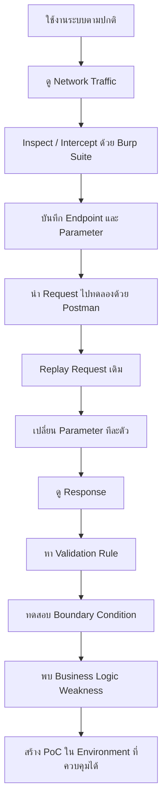
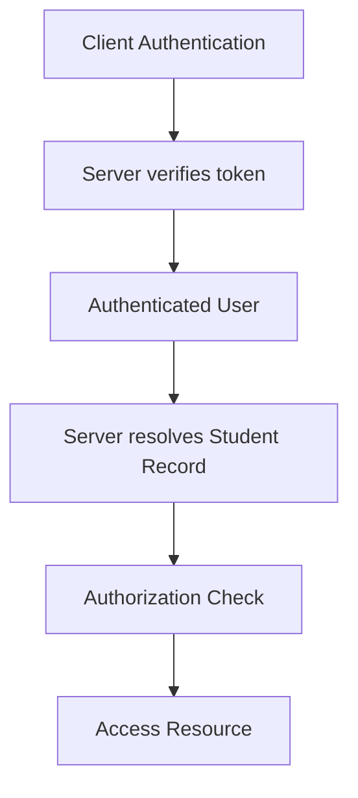
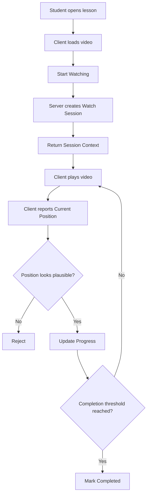
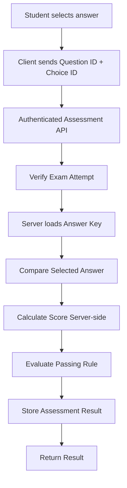
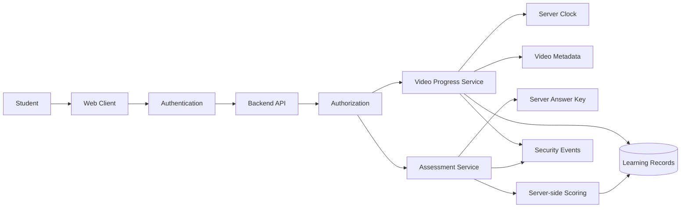

# OVEC Cloud Learning & Assessment Integrity — Security Research

> การศึกษาช่องโหว่ด้าน Business Logic, Client Trust, Video Progress และ Assessment Integrity
> จัดทำเพื่อการศึกษา Defensive Security และ Responsible Disclosure

---

## ⚠️ Important Notice

Repository นี้เป็นงานศึกษาด้าน Software Security และ Business Logic Vulnerability

ไม่ได้จัดทำขึ้นเพื่อสนับสนุนการโกงข้อสอบ การปลอมคะแนน การข้ามบทเรียน หรือการใช้งานช่องโหว่กับระบบจริงโดยไม่ได้รับอนุญาต

PoC หรือ Automation ที่เกี่ยวข้องกับงานวิจัยนี้ควรถูกใช้งานเฉพาะใน

```text
Local Lab
Mock API
Authorized Test Environment
```

เท่านั้น

ตัวอย่าง One-line Installer สำหรับ PoC ถูกปิดไว้ในเอกสาร Public:

```powershell
# Disabled in public documentation
# irm https://raw.githubusercontent.com/[REDACTED]/install.ps1 | iex
```

เหตุผลที่ไม่เผยแพร่คำสั่งใช้งานจริง เพราะช่องโหว่ที่อธิบายใน Repository นี้อาจมีผลต่อข้อมูล Learning Progress และ Assessment Result ของระบบ Production

---

# เกี่ยวกับงานวิจัยนี้

สวัสดีครับ ผมเป็นนักศึกษาจาก **วิทยาลัยเทคนิคนวมินทราชินีมุกดาหาร**

ผมสนใจด้าน

```text
Software Development
Full-Stack Development
Backend Development
API Design
System Architecture
Cybersecurity
Security Research
```

โปรเจกต์นี้เริ่มจากความสงสัยของผมเกี่ยวกับการทำงานของระบบเรียนออนไลน์

คำถามแรกที่ผมสงสัยคือ

> ระบบรู้ได้อย่างไรว่าผู้เรียนดูวิดีโอจริง?

จากนั้นคำถามก็ขยายต่อไปว่า

> ระบบรู้ได้อย่างไรว่าคะแนนหรือผลการตอบข้อสอบที่บันทึกอยู่ เป็นผลที่ Backend ตรวจสอบเองจริง ๆ?

จากคำถามเหล่านี้ ผมจึงเริ่มศึกษาการสื่อสารระหว่าง Client กับ Backend API

---

# จุดประสงค์

เป้าหมายของงานนี้ไม่ใช่การแสดงว่า

> "ผม Hack ระบบได้"

แต่ต้องการศึกษาให้เข้าใจว่า

```text
ระบบเชื่อข้อมูลอะไรจาก Client

Security Boundary อยู่ตรงไหน

Backend ตรวจสอบ State อย่างไร

Business Logic มี Edge Case อะไร

ผลกระทบเกิดขึ้นกับข้อมูลประเภทใด

และ Architecture ควรแก้ไขอย่างไร
```

---

# ถึงทีมผู้พัฒนาระบบ

ก่อนเข้าสู่รายละเอียด ผมอยากระบุให้ชัดเจนว่าผมไม่ได้มีเจตนาจะดูถูก ตำหนิ หรือด้อยค่าผลงานของทีมพัฒนาระบบ

ในฐานะคนที่เขียน Software เหมือนกัน ผมเข้าใจว่าระบบ Production จริงมีข้อจำกัดจำนวนมาก เช่น

```text
Requirement
Deadline
Budget
Legacy Code
Infrastructure
Compatibility
UX
Security
Maintenance
```

ไม่มี Software ใดสามารถรับประกันได้ว่าจะไม่มี Vulnerability

ระหว่างที่ผมศึกษา ผมพบว่าระบบมี Security Control อยู่แล้วหลายส่วน โดยเฉพาะ Logic ที่พยายามป้องกันการข้ามตำแหน่งวิดีโออย่างผิดปกติ

ตรงนี้ควรให้เครดิตกับทีมพัฒนา

สิ่งที่ผมพบจึงไม่ได้หมายความว่า

> "ผู้พัฒนาไม่ได้ทำ Security"

แต่เป็นกรณีที่ Security Control ที่มีอยู่ยังมี **Business Logic Edge Case**

อย่างไรก็ตาม หากพฤติกรรมที่พบสามารถเกิดขึ้นใน Production ได้จริง ผมคิดว่าควรพูดอย่างตรงไปตรงมาว่า **มีความเสี่ยงสูงและควรได้รับการตรวจสอบ**

โดยเฉพาะเมื่อระบบเกี่ยวข้องกับ Learning Progress และ Assessment Result

---

# Research Methodology

ผมไม่ได้เริ่มต้นจากการเขียน Python Script

ขั้นตอนแรกคือการใช้งานระบบตามปกติ

จากนั้นจึงค่อยตรวจสอบ HTTP Traffic

เครื่องมือที่ใช้ ได้แก่

| Tool                    | หน้าที่                                  |
| ----------------------- | ---------------------------------------- |
| Browser Developer Tools | ตรวจสอบ Request / Response               |
| Burp Suite              | Intercept และวิเคราะห์ HTTP Traffic      |
| Postman                 | Replay Request และปรับ Parameter ด้วยมือ |
| Notepad                 | จด Endpoint, Parameter และพฤติกรรม       |
| Python                  | ทำ Automation หลังเข้าใจ Logic แล้ว      |

Workflow โดยรวม:



วิธีนี้ทำให้ผมเข้าใจว่า Vulnerability เกิดขึ้นเพราะอะไร ไม่ใช่เพียงเห็นว่า Script ทำงานได้

---

# Finding 1 — Client-Exposed API Credential

ระหว่างตรวจสอบ HTTP Request ผมพบค่าที่มีลักษณะเป็น API Credential ถูกส่งจาก Client ไปยัง Backend

ตัวอย่างแบบ Sanitized:

```json
{
  "ApiKey": "[REDACTED]",
  "student_id": "[REDACTED]",
  "resource_id": "[REDACTED]"
}
```

ขอชี้แจงว่า Credential นี้ **ไม่ได้ถูกพบจาก Public Repository ของผู้พัฒนา**

ผมพบระหว่างตรวจสอบ HTTP Request และนำ Request ดังกล่าวมาศึกษาต่อผ่าน Postman และ Burp Suite

---

## Client-visible API Key ไม่ได้แปลว่าเป็นช่องโหว่ทันที

ตรงนี้ควรแยกให้ชัดเจน

การที่ API Key สามารถมองเห็นจาก Client ไม่ได้หมายความว่าเป็น Secret Leak โดยอัตโนมัติ

บางระบบมี Application Key ที่ตั้งใจให้ Client ใช้งาน

Architecture ที่ยอมรับได้อาจเป็น

```text
Client
   │
   │ Application Key
   ▼
Backend
   │
   ├── Authentication
   ├── Authorization
   ├── Ownership Validation
   ├── Rate Limiting
   └── Business Logic Validation
```

ปัญหาจะเกิดขึ้นเมื่อ Key ดังกล่าวกลายเป็น Security Boundary หลัก

```text
Client
   │
   │ Client-visible Credential
   ▼
Backend
   │
   └── Trust Request
```

ดังนั้นผมเลือกเรียกประเด็นนี้ว่า

> **Client-Exposed API Credential**

แทนที่จะสรุปว่าเป็น Credential Leak โดยทันที

---

# Finding 2 — User-Supplied Student Identifier

อีก Parameter ที่ควรระวังคือ Identifier ของนักศึกษา

หลักการสำคัญคือ

```text
Identifier != Identity
```

Server ไม่ควรคิดว่า

```text
Client ส่ง student_id = X
            ↓
Client เป็น Student X
```

เพียงเพราะ Client รู้ Identifier

แนวทางที่ปลอดภัยกว่าคือ



กล่าวคือ Backend ควรผูกข้อมูลกับ Identity ที่ได้รับจาก Authentication Context

ไม่ใช่เชื่อ Identifier ที่ Client ส่งมาเพียงอย่างเดียว

---

# Finding 3 — Video Progress Integrity

จุดที่ทำให้ผมสนใจระบบนี้มากขึ้นคือ Logic ป้องกันการข้าม Video Progress

จากการทดลอง พบว่าระบบมีการตรวจสอบการกระโดดของตำแหน่งวิดีโอ

ตัวอย่าง:

```text
Current Position = 5 seconds
```

หาก Client รายงานทันทีว่า

```text
Current Position = 10000 seconds
```

Backend สามารถตรวจจับพฤติกรรมที่ผิดปกติได้

นี่ถือเป็น Security Control ที่ดี

แต่สิ่งที่น่าสนใจคือ Boundary Condition

---

## Position Validation

สมมติ Progress เพิ่มเป็น

```text
5
10
15
20
25
30
```

เมื่อดูแต่ละ Request แยกกัน

```text
5 → 10
10 → 15
15 → 20
20 → 25
25 → 30
```

แต่ละช่วงอาจดูสมเหตุสมผล

ปัญหาคือยังมีอีกตัวแปรหนึ่งที่ต้องนำมาพิจารณา

> **เวลา**

---

# Root Cause — Position Is Not Time

สมมติ Client รายงานว่า Progress เพิ่มขึ้น 30 วินาที

แต่ทั้งหมดเกิดขึ้นในเวลาเพียงเล็กน้อย

Backend อาจเห็นว่า

```text
Position Delta = Valid
```

แต่ในความเป็นจริง

```text
Server Time Delta = Impossible
```

ดังนั้น

```text
Position Validation
!=
Real Watch-Time Validation
```

นี่คือ Business Logic Issue ที่สำคัญ

---

# Trust Boundary

ข้อมูลประเภท

```text
current_position
video_duration
progress_state
completion_state
```

หากมาจาก Client ต้องถือว่าเป็น

```text
Untrusted Input
```

เสมอ

ไม่ว่า Client นั้นจะเป็น

```text
Browser
JavaScript
Mobile Application
Postman
Burp Suite
Custom HTTP Client
```

เพราะ HTTP Request สามารถถูกสร้างใหม่หรือแก้ไขได้

---

# Video Progress Flow



จุดสำคัญอยู่ที่

```text
Client reports Current Position
```

เพราะ Client เป็นผู้ควบคุมข้อมูลดังกล่าว

---

# Finding 4 — Session Token Does Not Prove Watching

Watching Session เป็นแนวทางที่ดี

Flow โดยประมาณ:

```text
Start Watching
      ↓
Create Session
      ↓
Session Context
      ↓
Update Progress
      ↓
Complete Video
```

อย่างไรก็ตาม

```text
Valid Session
!=
Proof of Watching
```

Session สามารถพิสูจน์ได้ว่า Session นั้นมีอยู่

แต่ไม่สามารถพิสูจน์โดยตัวมันเองว่า

```text
ผู้ใช้ใช้เวลารับชมจริง
```

---

# Finding 5 — Assessment Integrity

ประเด็นที่ผมมองว่าร้ายแรงกว่าการข้ามวิดีโอ คือเรื่อง **ความถูกต้องของผลการทำแบบทดสอบ**

จากการศึกษาพฤติกรรมของ Quiz / Assessment Flow ผมพบว่ามี State บางส่วนเกี่ยวกับคำตอบหรือผลการประเมินไหลผ่าน Client

ประเด็นสำคัญคือ

> Backend ต้องเป็นผู้ตัดสินว่า Answer ถูกหรือผิดเอง

ไม่ควรให้ Client เป็นผู้กำหนด Truth ของผลสอบ

---

# Client Must Not Decide Correctness

สิ่งที่ Client ควรส่งคือประมาณ

```text
Question ID
Selected Choice ID
```

จากนั้น Server ทำ

```text
Load Question
      ↓
Load Answer Key
      ↓
Compare Answer
      ↓
Calculate Score
      ↓
Determine Pass / Fail
      ↓
Store Result
```

กล่าวคือ

> **Client sends answers. Server calculates truth.**

---

# Insecure Assessment Trust Model

สิ่งที่ไม่ควรเกิดขึ้น:

```text
Client
 ├── selected_answer
 ├── is_correct
 ├── score
 └── pass
        │
        ▼
Server trusts values
```

เพราะ Client-controlled value สามารถถูกแก้ไขได้

---

# Secure Assessment Flow



---

# Why Assessment Integrity Matters

Video Progress ที่ผิดอาจทำให้ Learning Record ไม่ถูกต้อง

แต่ Assessment Result ที่ถูก Manipulate ส่งผลโดยตรงกับ

```text
คะแนนสอบ
ผลผ่าน / ไม่ผ่าน
การปลดล็อกบทเรียน
Eligibility
Course Completion
Certificate
Academic Reporting
```

ดังนั้น Impact ไม่ได้อยู่แค่

> "มีคนโกงข้อสอบได้"

แต่คือ

> **ระบบสามารถรับรองได้หรือไม่ว่าคะแนนที่บันทึกอยู่เป็นคะแนนที่ Backend คำนวณจากคำตอบจริง**

นี่คือปัญหาด้าน **Integrity**

---

# CIA Triad

Security มักแบ่งเป็น

```text
Confidentiality
Integrity
Availability
```

กรณีที่งานวิจัยนี้เน้นมากที่สุดคือ

```text
Integrity
```

โดยเฉพาะ

```text
Learning Record Integrity
Assessment Integrity
Completion Integrity
```

---

# Potential Impact

หาก Findings เหล่านี้ได้รับการยืนยันใน Production Environment ผลกระทบอาจรวมถึง

```text
False Video Completion
Incorrect Learning Progress
Incorrect Examination Score
False Pass / Fail Result
Unauthorized Course Completion
Invalid Certificate Eligibility
Corrupted Learning Record
Unreliable Reporting
Loss of Trust in Assessment Data
```

---

# Severity Overview

| Finding                               | Estimated Severity |
| ------------------------------------- | ------------------ |
| Client-exposed application credential | Medium             |
| Weak ownership validation             | High               |
| Client-controlled progress state      | High               |
| Missing watch-time correlation        | High               |
| Weak completion validation            | High / Critical    |
| Client-influenced assessment result   | Critical           |
| Server not recalculating correctness  | Critical           |

> หมายเหตุ: Severity จริงควรได้รับการประเมินโดยผู้ดูแลระบบหลังตรวจสอบ Backend Implementation และ Authorization Model

---

# Core Security Problem

ทั้ง Video Progress และ Assessment Result มี Root Cause คล้ายกัน

คือ

> **Server เชื่อ Client-controlled State มากเกินไป**

ตัวอย่าง:

```text
Client says:
"I watched 30 seconds"

Server:
"Okay"
```

หรือ

```text
Client says:
"This answer is correct"

Server:
"Okay"
```

สิ่งที่ปลอดภัยกว่าคือ

```text
Client:
"I am reporting this event"

Server:
"I will verify and decide the state myself"
```

---

# Recommended Secure Architecture

หลักสำคัญคือ

> **Client reports events. Server decides state.**

---

# Secure Video Watch Session

Server สามารถเก็บ State เช่น

```text
watch_session_id
user_id
lesson_id
started_at
last_heartbeat_at
last_position
verified_watch_time
maximum_position
expires_at
status
```

โดยเวลาอย่าง

```text
started_at
last_heartbeat_at
```

ควรมาจาก Server Clock

---

# Progress Heartbeat Validation

เมื่อ Client ส่ง Progress Update

Server สามารถคำนวณ

```text
server_elapsed =
    now - last_heartbeat_at
```

และ

```text
position_delta =
    current_position - last_position
```

จากนั้นตรวจสอบ

```text
position_delta
vs
server_elapsed
```

---

# Example Validation Concept

ตัวอย่าง:

```text
Previous Position: 10 seconds
Current Position:  20 seconds

Position Delta:    10 seconds
Server Elapsed:    0.1 seconds
```

กรณีนี้ Progress ไม่สมเหตุสมผล

และสามารถ

```text
Reject
Throttle
Log
Flag
```

ได้

---

# Server-Owned Video Metadata

ข้อมูลอย่าง

```text
video_duration
required_watch_percentage
completion_threshold
```

ควรมี Source of Truth ฝั่ง Server

Client สามารถใช้ข้อมูลสำหรับ UI

แต่ Completion Decision ควรคำนวณจากข้อมูลที่ Server เชื่อถือได้

---

# Completion Validation

ไม่ควรตัดสินเพียง

```text
current_position >= duration
```

ควรพิจารณา

```text
Authenticated User
+
Authorized Lesson
+
Valid Session
+
Verified Watch Time
+
Server-known Duration
+
Completion Requirement
```

จากนั้น Server จึงเปลี่ยน State เป็น Completed

---

# Secure Assessment Architecture

สำหรับแบบทดสอบ Server ควรถือ Answer Key เอง

```text
Client Answer
      ↓
Authenticated API
      ↓
Active Attempt Validation
      ↓
Server Answer Key
      ↓
Server Scoring
      ↓
Immutable Result
```

Client ไม่ควรมี Authority ในการตัดสิน

```text
is_correct
score
passed
```

---

# Do Not Expose Answer Key Prematurely

ถ้า Client ได้รับ Correct Answer ก่อนการส่งคำตอบจริง จะทำให้ Trust Model อ่อนแอลงมาก

ดังนั้นข้อมูลที่ Client ต้องใช้ในการ Render Question ควรแยกจากข้อมูลที่ใช้ตรวจคำตอบ

ตัวอย่าง:

```text
Client receives:

question_id
question_text
choice_id
choice_text
```

แต่ไม่ควรได้รับ

```text
correct_choice
answer_key
server_score_rule
```

ก่อนสิ้นสุด Attempt

---

# Attempt Binding

การ Submit Answer ควรถูกผูกกับ

```text
Authenticated User
Exam ID
Attempt ID
Question ID
Server Session
Expiration
```

เพื่อป้องกันการ Replay หรือใช้ Request ข้าม Context

---

# Replay Protection

สามารถใช้กลไก เช่น

```text
sequence_number
nonce
timestamp
attempt state
idempotency key
```

ตามความเหมาะสม

---

# Rate Limiting

Progress และ Assessment Endpoint ควรมี Rate Limit

เช่น

```text
Per User
Per Session
Per Attempt
Per Resource
```

เพื่อช่วยลด Automated Abuse

แต่ Rate Limit ไม่ควรใช้แทน Business Logic Validation

---

# Security Monitoring

Event ที่อาจควร Flag:

```text
Video progresses faster than real time

Completion immediately after session creation

Unusually high progress request frequency

Repeated assessment submission

Duplicate answer submission

Impossible scoring transitions

Student identity mismatch

Session context mismatch

Token reuse

Multiple concurrent attempts with impossible timing
```

---

# Security Event Logging

สำหรับระบบที่ข้อมูลมีผลต่อผลการเรียน ควรมี Audit Trail เช่น

```text
user_id
student_id
resource_id
attempt_id
watch_session_id
event_type
server_timestamp
source_ip
user_agent
validation_result
reason
```

โดยคำนึงถึง Privacy และ Data Retention Policy ด้วย

---

# Secure Architecture Overview



---

# Main Security Principles

จากงานนี้ ผมได้สรุปหลักการสำคัญไว้ดังนี้

```text
API Key != Authentication
```

```text
Student ID != Authorization
```

```text
Session Token != Proof of Watching
```

```text
Position Validation != Watch-Time Validation
```

```text
Client Progress != Trusted Progress
```

```text
Client-provided Correctness != Correct Answer
```

```text
Client-calculated Score != Trusted Score
```

---

# สิ่งที่ผมได้เรียนรู้

ตอนแรกผมคิดว่า Security ของระบบ Web จะเกี่ยวกับเรื่องอย่าง

```text
SQL Injection
XSS
Authentication Bypass
Token
Encryption
```

เป็นหลัก

แต่โปรเจกต์นี้ทำให้ผมเข้าใจชัดขึ้นว่า

**Business Logic Security สำคัญไม่แพ้ Technical Vulnerability**

ระบบอาจไม่มี SQL Injection

ระบบอาจใช้ HTTPS

ระบบอาจมี Token

ระบบอาจมี Session

และทุก Endpoint สามารถ Response ได้ตามปกติ

แต่ก็ยังมี Vulnerability ได้ ถ้า Backend เชื่อ State จาก Client มากเกินไป

---

# สิ่งที่สำคัญที่สุด

จากทั้งหมดนี้ ผมคิดว่าประโยคที่อธิบายงานนี้ได้ดีที่สุดคือ

> **Never trust client-controlled state.**

และถ้าจะอธิบายในรูปแบบ Architecture:

> **Client reports events. Server decides state.**

สำหรับ Assessment:

> **Client sends answers. Server calculates truth.**

---

# Responsible Disclosure

ผมตั้งใจให้ Repository นี้เป็น

```text
Security Research
Defensive Security
Educational Material
Architecture Analysis
Responsible Disclosure
```

ไม่ใช่เครื่องมือสำหรับโจมตี Production System

ดังนั้นข้อมูลที่สามารถนำไปใช้โจมตีระบบได้ทันทีควรถูก Redact

เช่น

```text
Real API Key
Student Identifier
National ID
Session Token
Authentication Cookie
Access Token
Production Endpoint Payload
Reusable Exploit Request
```

---

# Credential Disclosure

หาก Credential ใดเคยถูกเผยแพร่โดยไม่ตั้งใจ ควรพิจารณา

```text
Rotate Credential
Invalidate Session
Review Access Logs
Audit Historical Requests
```

การลบ Credential ออกจาก README อย่างเดียวอาจไม่เพียงพอ หากค่าดังกล่าวเคยถูก Commit ลง Git History

---

# Personal Data

ข้อมูลนักศึกษา โดยเฉพาะข้อมูลที่สามารถเชื่อมโยงถึงบุคคลจริง ไม่ควรถูกนำมาใช้ใน Public PoC

ตัวอย่าง:

```json
{
  "student_id": "[REDACTED]"
}
```

เพียงเท่านี้ก็เพียงพอสำหรับการอธิบาย Security Issue

---

# About the PoC

ผมได้สร้าง Automation หลังจากเข้าใจพฤติกรรมของระบบผ่านการทดสอบด้วยมือแล้ว

อย่างไรก็ตาม Public Documentation จะไม่ให้คำสั่งที่สามารถนำไปใช้ Bypass Production System ได้โดยตรง

PoC ควรถูกใช้กับ

```text
Mock Server
Local Lab
Authorized Environment
```

และควรมีเป้าหมายเพื่อแสดงให้เห็น

```text
Root Cause
Validation Failure
Expected Behavior
Recommended Fix
```

ไม่ใช่เพื่อทำให้การ Abuse ระบบจริงง่ายขึ้น

---

# About Me

ผมเป็นนักศึกษาจาก

**วิทยาลัยเทคนิคนวมินทราชินีมุกดาหาร**

ผมสนใจด้าน

```text
Software Development
Full-Stack Development
Backend Development
API Design
System Architecture
Cybersecurity
Security Research
```

ผมยังอยู่ในช่วงเรียนรู้ และงานนี้เป็นหนึ่งในโปรเจกต์ที่ทำให้ผมได้เข้าใจ Security จากระบบจริงมากขึ้น

สิ่งที่ผมสนใจไม่ใช่แค่

> "ช่องโหว่อยู่ตรงไหน"

แต่คือ

> "ทำไมช่องโหว่นั้นถึงเกิดขึ้น และถ้าเราเป็นคนออกแบบระบบ เราจะแก้มันอย่างไร"

---

# Researcher

**ntdotjsx**

Student — **วิทยาลัยเทคนิคนวมินทราชินีมุกดาหาร**

GitHub: `github.com/ntdotjsx`

---

## Final Note

ผมขอขอบคุณผู้พัฒนาระบบที่สร้าง Platform นี้ขึ้นมา

การที่ผมพบ Security Issue ไม่ได้ทำให้ผมมองข้ามงานจำนวนมากที่อยู่เบื้องหลังระบบ

ในทางกลับกัน การที่ระบบมี Logic ป้องกันหลายส่วนอยู่แล้วทำให้ผมได้เรียนรู้มากขึ้นว่า

Security ไม่ได้จบเพียงแค่การเพิ่ม Validation หนึ่งตัว

แต่ต้องคิดถึง

```text
Identity
Authorization
Trust Boundary
State Management
Time
Replay
Data Integrity
Business Logic
```

ร่วมกัน

ผมหวังว่าการศึกษานี้จะมีประโยชน์ในแง่การปรับปรุงระบบและเป็นกรณีศึกษาสำหรับนักพัฒนาคนอื่น ๆ

---

> **Educational & Defensive Security Research Only**
>
> งานนี้จัดทำขึ้นเพื่อการศึกษา Software Security, Business Logic Security และ Responsible Disclosure เท่านั้น ไม่สนับสนุนการนำช่องโหว่หรือเครื่องมือที่เกี่ยวข้องไปใช้กับระบบหรือข้อมูลของบุคคลอื่นโดยไม่ได้รับอนุญาต
