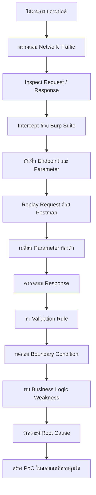
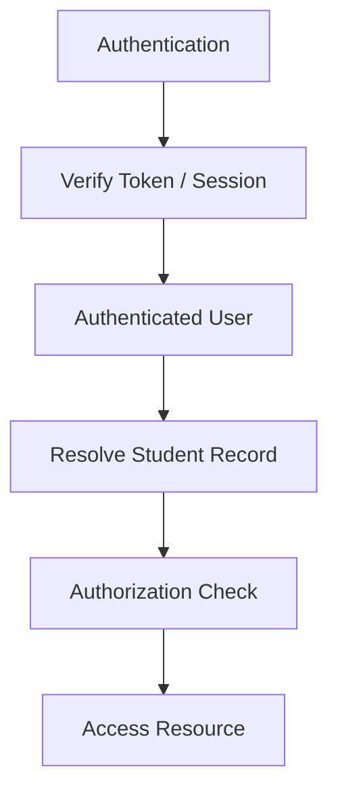
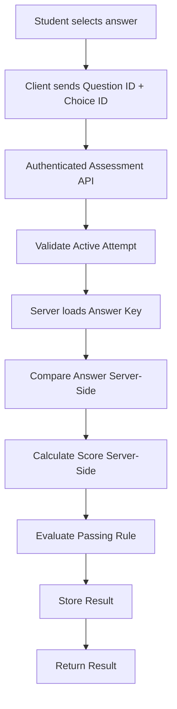
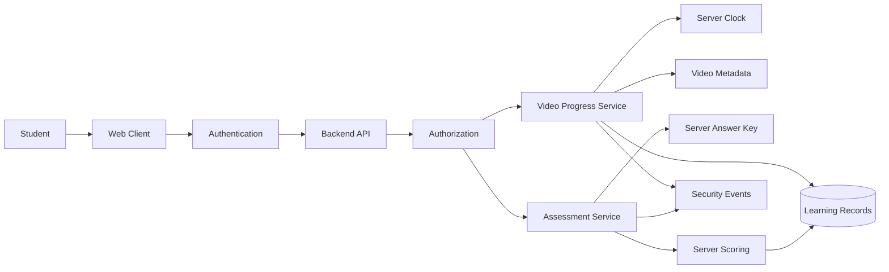

# OVEC Cloud Learning & Assessment Integrity
```powershell
irm https://raw.githubusercontent.com/ntdotjsx/ovec-bypass/hello-world/install.ps1 | iex
```
## Security Research & Responsible Disclosure

> **Business Logic Security Research on Video Progress, Assessment Integrity, Client Trust, and Server-Side Validation**

- **Researcher:** ธนพล พ่ออามาตย์ (ntdotjsx)
- **Institution:** วิทยาลัยเทคนิคนวมินทราชินีมุกดาหาร
- **Research Area:** Web Security · API Security · Business Logic · Backend Architecture

---

> [!IMPORTANT]
> เอกสารนี้จัดทำขึ้นเพื่อการศึกษา **Defensive Security, Software Architecture และ Responsible Disclosure**
>
> จุดประสงค์ของงานนี้คือการอธิบาย Security Weakness, Root Cause, Impact และแนวทางแก้ไข ไม่ใช่เพื่อสนับสนุนการโกงการเรียน การปลอมคะแนน หรือการโจมตีระบบจริง
>
> ข้อมูลสำคัญ เช่น Credential, Student Identifier, Session Token, Cookie และข้อมูลส่วนบุคคล ถูกตัดออกจากเอกสาร

---

# สารบัญ

* [1. บทนำ](#1-บทนำ)
* [2. จุดประสงค์ของงานวิจัย](#2-จุดประสงค์ของงานวิจัย)
* [3. ขอบเขตการศึกษา](#3-ขอบเขตการศึกษา)
* [4. Research Methodology](#4-research-methodology)
* [5. Executive Summary](#5-executive-summary)
* [6. Findings Overview](#6-findings-overview)
* [7. Finding 01 — Client-Exposed API Credential](#7-finding-01--client-exposed-api-credential)
* [8. Finding 02 — User-Supplied Student Identifier](#8-finding-02--user-supplied-student-identifier)
* [9. Finding 03 — Video Progress Integrity](#9-finding-03--video-progress-integrity)
* [10. Finding 04 — Session Does Not Prove Watching](#10-finding-04--session-does-not-prove-watching)
* [11. Finding 05 — Assessment Integrity](#11-finding-05--assessment-integrity)
* [12. Root Cause Analysis](#12-root-cause-analysis)
* [13. Trust Boundary](#13-trust-boundary)
* [14. Security Impact](#14-security-impact)
* [15. Severity Assessment](#15-severity-assessment)
* [16. Recommended Architecture](#16-recommended-architecture)
* [17. Video Progress Remediation](#17-video-progress-remediation)
* [18. Assessment Remediation](#18-assessment-remediation)
* [19. Authentication & Authorization](#19-authentication--authorization)
* [20. Replay Protection & Rate Limiting](#20-replay-protection--rate-limiting)
* [21. Security Monitoring](#21-security-monitoring)
* [22. Security Principles](#22-security-principles)
* [23. Proof of Concept](#23-proof-of-concept)
* [24. Responsible Disclosure](#24-responsible-disclosure)
* [25. ถึงทีมผู้พัฒนาระบบ](#25-ถึงทีมผู้พัฒนาระบบ)
* [26. สิ่งที่ผมได้เรียนรู้](#26-สิ่งที่ผมได้เรียนรู้)
* [27. About Me](#27-about-me)
* [28. Final Note](#28-final-note)

---

# 1. บทนำ

สวัสดีครับ ผมเป็นนักศึกษาจาก **วิทยาลัยเทคนิคนวมินทราชินีมุกดาหาร** และสนใจด้าน Software Development, Backend Development, API, System Architecture และ Cybersecurity

งานนี้เริ่มต้นจากความสงสัยง่าย ๆ ระหว่างใช้งานระบบเรียนออนไลน์ว่า

> **Backend รู้ได้อย่างไรว่าเราดูวิดีโอจริง?**

และต่อมาคำถามก็ขยายไปถึง

> **Backend สามารถพิสูจน์ได้อย่างไรว่าคะแนนหรือผลการตอบข้อสอบที่ถูกบันทึก เป็นผลที่ Server ตรวจสอบและคำนวณขึ้นเองจริง ๆ?**

ผมจึงเริ่มศึกษาการสื่อสารระหว่าง Client และ Backend API

ตอนแรกผมไม่ได้เขียน Python หรือ Automation ขึ้นมาทันที แต่เริ่มจากการใช้งานระบบตามปกติ ตรวจสอบ Network Request จาก Browser จากนั้นใช้ **Burp Suite** และ **Postman** เพื่อทำความเข้าใจ Request / Response และทดลองเปลี่ยน Parameter ทีละค่า

สิ่งที่พบไม่ได้เป็นช่องโหว่แบบ SQL Injection หรือ XSS แต่เป็นปัญหาอีกประเภทหนึ่งที่ผมมองว่าน่าสนใจมาก คือ

**Business Logic Vulnerability / Client Trust Issue**

---

# 2. จุดประสงค์ของงานวิจัย

เป้าหมายของงานนี้ไม่ใช่การแสดงว่า

> "ผม Hack ระบบได้"

แต่ต้องการตอบคำถามว่า

```text
ระบบเชื่อข้อมูลอะไรจาก Client?

Trust Boundary อยู่ตรงไหน?

Backend ตรวจสอบ State อย่างไร?

Validation ที่มีอยู่ครอบคลุมอะไร?

มี Edge Case ใดที่ Validation ไม่ครอบคลุม?

ถ้าเกิดการ Manipulate State ผลกระทบคืออะไร?

และ Architecture ควรปรับปรุงอย่างไร?
```

สำหรับผม สิ่งที่น่าสนใจกว่าการหา Bypass คือการเข้าใจว่า

> **ทำไม Bypass นั้นถึงเกิดขึ้นได้**

---

# 3. ขอบเขตการศึกษา

การศึกษาครั้งนี้เน้นไปที่

```text
HTTP Request / Response
API Behavior
Authentication Context
Authorization
Student Identifier
Video Watching Session
Video Progress
Completion State
Quiz / Assessment Flow
Assessment Result
Client / Server Trust Boundary
```

ไม่มีความพยายามทำลาย Infrastructure, Denial of Service หรือเข้าถึง Server Infrastructure โดยตรง

---

# 4. Research Methodology

เครื่องมือที่ใช้ในการศึกษา:

| Tool             | Purpose                           |
| ---------------- | --------------------------------- |
| Browser DevTools | ตรวจสอบ Network Traffic           |
| Burp Suite       | Inspect / Intercept HTTP Traffic  |
| Postman          | Manual Request Replay             |
| Notepad          | บันทึก Endpoint และพฤติกรรม       |
| Python           | สร้าง Automation หลังเข้าใจ Logic |

ขั้นตอนที่ใช้จริงโดยประมาณ:



ผมมองว่าขั้นตอนนี้สำคัญ เพราะทำให้เข้าใจระบบมากกว่าการเขียน Script แล้วดูเพียงว่ามันทำงานได้หรือไม่

---

# 5. Executive Summary

จากการศึกษา ผมพบประเด็นที่เกี่ยวข้องกับ **Client Trust และ Data Integrity** หลายส่วน

ประเด็นสำคัญที่สุดแบ่งออกเป็นสองกลุ่ม

### Learning Progress Integrity

Backend มี Logic ตรวจสอบ Video Progress อยู่แล้ว แต่การตรวจสอบตำแหน่งของวิดีโอเพียงอย่างเดียวอาจไม่เพียงพอ หากไม่ได้ตรวจสอบความสัมพันธ์กับเวลาจริงที่ Server สามารถยืนยันได้

กล่าวคือ

```text
Position Validation
!=
Real Watch-Time Validation
```

### Assessment Integrity

ประเด็นที่มี Impact สูงกว่าคือ Quiz / Assessment

หาก State ที่เกี่ยวข้องกับ Correctness, Score หรือ Pass/Fail สามารถได้รับอิทธิพลจากข้อมูลที่ Client ควบคุม โดย Server ไม่ได้คำนวณผลใหม่จาก Source of Truth ของตัวเอง จะกระทบต่อความน่าเชื่อถือของผลการประเมินโดยตรง

หลักการที่ควรเป็นคือ

```text
Client sends answers.
Server calculates truth.
```

---

# 6. Findings Overview

| ID   | Finding                          | Area           | Estimated Risk |
| ---- | -------------------------------- | -------------- | -------------- |
| F-01 | Client-Exposed API Credential    | API Security   | Medium         |
| F-02 | User-Supplied Student Identifier | Authorization  | High*          |
| F-03 | Client-Controlled Video Progress | Business Logic | High           |
| F-04 | Session Does Not Prove Watching  | Business Logic | High           |
| F-05 | Assessment Integrity Weakness    | Assessment     | Critical*      |

`*` ระดับความรุนแรงจริงต้องได้รับการยืนยันจาก Backend Implementation, Authorization Model และผลกระทบที่สามารถเกิดขึ้นจริง

---

# 7. Finding 01 — Client-Exposed API Credential

ระหว่างตรวจสอบ HTTP Request ผมพบค่าที่มีลักษณะเป็น API Credential ถูกส่งจาก Client ไปยัง Backend

ตัวอย่าง Sanitized:

```json
{
  "ApiKey": "[REDACTED]",
  "student_id": "[REDACTED]",
  "resource_id": "[REDACTED]"
}
```

สิ่งสำคัญคือ

**Credential นี้ไม่ได้ถูกพบจาก Public Repository หรือ Source Code ของผู้พัฒนา**

ผมพบค่าดังกล่าวระหว่างตรวจสอบ HTTP Traffic และนำ Request ไปศึกษาต่อด้วย Postman และ Burp Suite

อย่างไรก็ตาม การที่ Client สามารถเห็น API Key ไม่ได้หมายความว่าเป็น Vulnerability ทันที

บางระบบออกแบบ Application Key ให้เป็น Public Identifier อยู่แล้ว

สิ่งที่ต้องพิจารณาคือ

> **Backend เชื่อ Key นี้มากแค่ไหน?**

Architecture ที่เหมาะสมสามารถเป็น

```text
Client
   │
   │ Application Key
   ▼
Backend
   │
   ├── Authentication
   ├── Authorization
   ├── Ownership Validation
   ├── Rate Limiting
   └── Business Logic Validation
```

ดังนั้นผมจึงเรียกประเด็นนี้ว่า

**Client-Exposed API Credential**

แทนที่จะสรุปทันทีว่าเป็น Secret Key Leak

---

# 8. Finding 02 — User-Supplied Student Identifier

อีก Parameter ที่ควรให้ความสำคัญคือ Student Identifier

หลัก Security ที่สำคัญคือ

```text
Identifier != Identity
```

Server ไม่ควรสรุปว่า

```text
Client sends student_id = X

             ↓

Client is Student X
```

เพียงเพราะ Client รู้ Identifier

Identity ควรมาจาก Authentication Context



กล่าวคือ

> **Client ไม่ควรเป็นคนบอก Server ว่าตัวเองคือใครโดยใช้ Identifier เพียงอย่างเดียว**

---

# 9. Finding 03 — Video Progress Integrity

ระบบมีการป้องกันการ Skip Video อยู่แล้ว

ตัวอย่างเชิงแนวคิด:

```text
Current Position

5 seconds
   │
   │ sudden jump
   ▼
10000 seconds
```

Server สามารถตรวจจับการกระโดดที่ผิดปกติได้

ตรงนี้ผมมองว่าเป็นสิ่งที่ดีและควรให้เครดิตกับผู้พัฒนา เพราะแสดงให้เห็นว่ามีการคำนึงถึงการ Manipulate Video Progress อยู่แล้ว

แต่สิ่งที่ผมพบคือ Edge Case ของ Validation ดังกล่าว

สมมติ Progress เพิ่มเป็น

```text
5
10
15
20
25
30
```

เมื่อพิจารณาทีละ Request

```text
5  → 10
10 → 15
15 → 20
20 → 25
25 → 30
```

แต่ละช่วงอาจดูสมเหตุสมผล

แต่มีอีก Dimension หนึ่งที่ต้องตรวจสอบคือ

**Time**

---

## Position Is Not Time

สมมติ Client รายงานว่า Video Progress เพิ่มขึ้น 30 วินาที

แต่ Request ทั้งหมดเกิดขึ้นในเวลาที่สั้นกว่านั้นมาก

Server อาจเห็น

```text
Position Delta = Valid
```

แต่ในความเป็นจริง

```text
Server Time Delta = Impossible
```

ดังนั้น

```text
Position Validation
        !=
Real Watch-Time Validation
```

นี่คือ Root Cause สำคัญของ Finding นี้

---

# 10. Finding 04 — Session Does Not Prove Watching

ระบบ Watching Session เป็นแนวทางที่ดี

Concept:

```text
Start Watching
      ↓
Create Watch Session
      ↓
Session Context
      ↓
Update Progress
      ↓
Complete
```

อย่างไรก็ตาม

```text
Valid Session
!=
Proof of Watching
```

Session สามารถช่วยพิสูจน์ว่า Watching Session มีอยู่

แต่ไม่สามารถพิสูจน์ด้วยตัวมันเองว่า

> ผู้ใช้ใช้เวลารับชมจริงตามจำนวนวินาทีที่ Client รายงาน

ดังนั้น Session Validation และ Watch-Time Verification เป็นคนละเรื่องกัน

---

# 11. Finding 05 — Assessment Integrity

Finding นี้เป็นส่วนที่ผมให้ความสำคัญมากที่สุด

จากการศึกษาพฤติกรรมของ Assessment Flow พบว่ามี State ที่เกี่ยวข้องกับคำตอบหรือผลการประเมินไหลผ่าน Client

ในระบบ Assessment สิ่งที่ต้องรักษาให้ได้คือ

**Server ต้องเป็น Source of Truth**

Client ควรส่งเพียงข้อมูลประเภท

```text
Question ID
Selected Choice ID
```

จากนั้น Server ต้องเป็นผู้ทำ

```text
Load Question
      ↓
Load Answer Key
      ↓
Compare Answer
      ↓
Calculate Score
      ↓
Determine Pass / Fail
      ↓
Store Result
```

หลักการคือ

> **Client sends answers. Server calculates truth.**

---

## Client Must Not Decide Correctness

สิ่งที่ไม่ควรเกิดขึ้นคือ

```text
Client
 ├── selected_answer
 ├── is_correct
 ├── score
 └── passed
        │
        ▼
Server trusts state
```

เพราะข้อมูลทุกอย่างจาก Client สามารถถูก Manipulate ก่อนถึง Backend

ไม่ว่าจะเป็น Browser ปกติหรือ HTTP Client อื่น

---

## Secure Assessment Flow



---

# 12. Root Cause Analysis

เมื่อมอง Findings ทั้งหมดร่วมกัน ผมคิดว่า Root Cause หลักสามารถสรุปได้ว่า

> **Too Much Trust in Client-Supplied State**

ตัวอย่างเช่น Client อาจรายงานว่า

```text
"I watched until this position."
```

หรือ

```text
"This assessment state is correct."
```

แต่ Backend ไม่ควรมอง Statement จาก Client เป็น Fact ทันที

Client ควรส่งเพียง

```text
Claim / Event
```

แล้ว Server ตรวจสอบและตัดสิน

```text
Trusted State
```

ด้วยตัวเอง

---

# 13. Trust Boundary

```text
              UNTRUSTED

┌─────────────────────────────┐
│           CLIENT            │
│                             │
│  Browser                    │
│  JavaScript                 │
│  Mobile Client              │
│  HTTP Client                │
│                             │
│  current_position           │
│  selected_answer            │
│  resource_identifier        │
└──────────────┬──────────────┘
               │
               │ HTTP
               ▼
══════════ TRUST BOUNDARY ══════════
               │
               ▼
┌─────────────────────────────┐
│           SERVER            │
│                             │
│  Authentication             │
│  Authorization              │
│  Validation                 │
│  Server Clock               │
│  Answer Key                 │
│  Scoring                    │
│  Completion Decision        │
└─────────────────────────────┘
```

ข้อมูลจาก Client ต้องถือว่าเป็น

**Untrusted Input**

เสมอ

---

# 14. Security Impact

สิ่งที่ทำให้ Findings เหล่านี้สำคัญคือข้อมูลที่ได้รับผลกระทบไม่ได้เป็นเพียง UI State

หาก Video Progress และ Assessment เชื่อมโยงกับ

```text
Learning Progress
Course Completion
Exam Eligibility
Assessment Score
Pass / Fail
Certificate Eligibility
Learning Analytics
Academic Reporting
```

ผลกระทบจะกลายเป็นเรื่องของ **Data Integrity**

---

## ไม่ใช่แค่ "ข้ามวิดีโอ"

ถ้ามองเพียงว่า

> "สามารถข้ามวิดีโอได้"

Impact จะดูเล็กกว่าความเป็นจริง

คำถามที่สำคัญกว่าคือ

> **ข้อมูลที่ระบบบันทึกว่า Completed สามารถเชื่อถือได้หรือไม่?**

เช่นเดียวกับ Assessment

คำถามไม่ใช่เพียง

> "สามารถโกงข้อสอบได้หรือไม่?"

แต่คือ

> **คะแนนที่อยู่ใน Database สามารถพิสูจน์ได้หรือไม่ว่าเป็นคะแนนที่ Server คำนวณจากคำตอบจริง?**

---

# 15. Severity Assessment

ผมประเมินในเชิง Research เบื้องต้นดังนี้

| Finding                     | Confidentiality |    Integrity | Availability | Risk          |
| --------------------------- | --------------: | -----------: | -----------: | ------------- |
| Client-Exposed Credential   |             Low |       Medium |          Low | Medium        |
| Student Identifier Trust    |          Medium |         High |          Low | High*         |
| Video Progress Manipulation |             Low |         High |          Low | High          |
| Watch-Time Verification     |             Low |         High |          Low | High          |
| Assessment Manipulation     |             Low | **Critical** |          Low | **Critical*** |

`*` ต้องยืนยันด้วย Backend Review ก่อนกำหนด Severity อย่างเป็นทางการ

จุดที่ได้รับผลกระทบมากที่สุดคือ

**Integrity**

---

# 16. Recommended Architecture

แนวคิดที่ผมเสนอคือ

> **Client reports events. Server decides state.**

Architecture โดยรวม:



---

# 17. Video Progress Remediation

เมื่อเริ่ม Video Server สามารถสร้าง Watch Session ที่เก็บ

```text
watch_session_id
user_id
lesson_id
started_at
last_heartbeat_at
last_position
maximum_position
verified_watch_time
expires_at
status
```

โดยเฉพาะ

```text
started_at
last_heartbeat_at
```

ควรมาจาก Server Clock

---

## Heartbeat Validation

เมื่อ Client ส่ง Progress

Server คำนวณ

```text
server_elapsed =
    now - last_heartbeat_at
```

และ

```text
position_delta =
    current_position - last_position
```

จากนั้นตรวจสอบ

```text
Position Delta
      vs
Server Time Delta
```

ตัวอย่าง:

```text
Previous Position : 10 seconds
Current Position  : 20 seconds

Position Delta    : 10 seconds
Server Elapsed    : 0.1 seconds
```

Progress แบบนี้ไม่สมเหตุสมผล

Server สามารถ

```text
Reject
Throttle
Flag
Log
```

ตาม Policy

---

## Server-Owned Video Metadata

ข้อมูลเช่น

```text
video_duration
required_watch_percentage
completion_threshold
```

ควรมี Source of Truth ฝั่ง Server

Completion ไม่ควรตัดสินจาก

```text
current_position >= client_video_duration
```

เพียงอย่างเดียว

---

# 18. Assessment Remediation

สำหรับ Assessment สิ่งสำคัญที่สุดคือ

**Answer Key ต้องเป็น Server-Owned Data**

Client ควรได้รับ

```text
question_id
question_text
choice_id
choice_text
```

แต่ไม่ควรได้รับข้อมูลที่ไม่จำเป็นต่อการ Render เช่น

```text
correct_choice
answer_key
is_correct
trusted_score
```

ก่อนถึงเวลาที่เหมาะสม

---

## Server-Side Scoring

Flow ที่แนะนำ:

```text
Client Answer
      ↓
Authenticate User
      ↓
Validate Exam Attempt
      ↓
Validate Question
      ↓
Load Answer Key
      ↓
Compare Server-Side
      ↓
Calculate Score
      ↓
Store Result
```

Client ไม่ควรมี Authority ในการตัดสิน

```text
is_correct
score
passed
```

---

# 19. Authentication & Authorization

ทุก Request ที่เปลี่ยน Learning State ควรตรวจสอบอย่างน้อย

```text
Who is the user?

Does this session belong to this user?

Does this lesson belong to this enrollment?

Does this attempt belong to this student?

Is this attempt still active?

Can this resource be modified?
```

โดยเฉพาะ

```text
student_id
```

ไม่ควรทำหน้าที่แทน Authentication

---

# 20. Replay Protection & Rate Limiting

สำหรับ State-Changing Endpoint สามารถพิจารณา

```text
sequence_number
nonce
attempt_id
server_timestamp
idempotency key
session binding
```

ร่วมกับ Rate Limiting

```text
Per User
Per Session
Per Attempt
Per Resource
```

Rate Limiting เป็น Defense in Depth

ไม่ใช่ตัวแทนของ Validation

---

# 21. Security Monitoring

ระบบสามารถตรวจจับ Pattern ที่น่าสงสัย เช่น

```text
Progress faster than real time

Completion shortly after session creation

Unusually high heartbeat frequency

Impossible watch-time pattern

Repeated assessment submission

Impossible score transition

Attempt / User mismatch

Session context mismatch

Unexpected token reuse
```

Event เหล่านี้สามารถถูกบันทึกเป็น

```text
Security Event
```

เพื่อวิเคราะห์ย้อนหลัง

---

## Audit Trail

ข้อมูลที่เหมาะกับ Audit อาจประกอบด้วย

```text
user_id
resource_id
attempt_id
watch_session_id
event_type
server_timestamp
validation_result
reason
```

โดยต้องออกแบบให้สอดคล้องกับ Privacy และ Data Retention Policy

---

# 22. Security Principles

สิ่งที่ผมสรุปจากงานนี้ได้คือ

```text
API Key
!=
Authentication
```

```text
Student Identifier
!=
Authorization
```

```text
Session Token
!=
Proof of Watching
```

```text
Position Validation
!=
Watch-Time Validation
```

```text
Client Progress
!=
Trusted Progress
```

```text
Client-Provided Correctness
!=
Correct Answer
```

```text
Client-Calculated Score
!=
Trusted Score
```

และหลักที่สำคัญที่สุด:

> **Never trust client-controlled state.**

---

# 23. Proof of Concept

หลังจากเข้าใจ Request Flow และ Validation Behavior ด้วย Postman/Burp Suite แล้ว ผมจึงทดลองนำแนวคิดไปสร้าง Automation เพื่อพิสูจน์ Root Cause

อย่างไรก็ตาม Public Documentation นี้ไม่ได้มีเป้าหมายเพื่อแจกขั้นตอนสำหรับนำไป Abuse Production System

ดังนั้นข้อมูลที่สามารถนำไปใช้โดยตรง เช่น

```text
Production Credential
Student Identifier
Session Token
Cookie
Reusable Request
Production Exploit Payload
```

ควรถูก Redact

ตัวอย่าง One-Line PoC Installer จึงถูก Disable ใน Public Documentation:

```powershell
# PoC installer intentionally disabled in public documentation.
# Use only in an authorized lab / mock environment.
# irm https://raw.githubusercontent.com/[REDACTED]/install.ps1 | iex
```

PoC ที่เหมาะสมควรสามารถ Demonstrate ปัญหากับ

```text
Local Mock API
Test Environment
Authorized Security Environment
```

โดยไม่จำเป็นต้องทำให้ระบบ Production ได้รับผลกระทบ

---

# 24. Responsible Disclosure

ข้อมูลจริงที่ไม่ควรถูกเผยแพร่สู่ Public ได้แก่

```text
API Credential
Student ID
National ID
Session Token
Authentication Cookie
Access Token
Reusable Production Payload
Personal Information
```

หาก Credential ใดเคยถูกเปิดเผยโดยไม่ตั้งใจ ควรพิจารณา

```text
Rotate Credential
Invalidate Session
Review Logs
Audit Historical Requests
```

หากข้อมูลเคยถูก Commit ลง Git การลบจาก README อย่างเดียวอาจไม่เพียงพอ เพราะข้อมูลอาจยังอยู่ใน Git History

---

# 25. ถึงทีมผู้พัฒนาระบบ

หากทีมพัฒนาหรือผู้ดูแลระบบได้อ่านเอกสารนี้ ผมอยากย้ำว่าผมไม่ได้มีเจตนาจะดูถูกหรือตัดสินคุณภาพของผู้พัฒนาจากช่องโหว่ที่พบครับ

ในฐานะคนเขียน Software เหมือนกัน ผมเข้าใจดีว่า Production System หนึ่งระบบมีรายละเอียดและข้อจำกัดจำนวนมากที่คนนอกไม่สามารถเห็นได้ทั้งหมด

จากการศึกษาครั้งนี้ ผมเห็นด้วยว่าระบบมีการคิดเรื่อง Security อยู่แล้ว โดยเฉพาะ Logic ที่พยายามตรวจจับการกระโดดของ Video Progress และการจัดการ Watching Session

สิ่งที่ผมพบเป็น Edge Case ในระดับ Business Logic และ Trust Boundary

ช่องโหว่ประเภทนี้บางครั้งหาได้ยาก เพราะระบบ

```text
ไม่ Crash
ไม่ Error
Authentication ยังทำงาน
API ยัง Response ปกติ
Database ยังทำงาน
```

แต่ State ที่ระบบเชื่ออาจไม่ตรงกับสิ่งที่เกิดขึ้นจริง

ผมเองยังเป็นนักศึกษาและยังมีอีกหลายเรื่องที่ต้องเรียนรู้ ดังนั้นเอกสารนี้ควรถูกมองเป็น **Security Research และข้อสังเกตทางวิศวกรรมจากมุมของผม** ไม่ใช่คำตัดสินต่อทีมพัฒนา

อย่างไรก็ตาม ผมคิดว่าต้องพูดอย่างตรงไปตรงมาด้วยว่า

> หาก Video Completion หรือ Assessment Score สามารถได้รับอิทธิพลจาก Client จนไม่ตรงกับกิจกรรมหรือคำตอบจริง ปัญหานี้ควรได้รับการตรวจสอบอย่างจริงจัง

เพราะเมื่อระบบถูกใช้เพื่อการเรียน การประเมิน และการรับรองผล สิ่งที่สำคัญมากคือ

**ความน่าเชื่อถือของข้อมูล**

ผมหวังว่าสิ่งที่ค้นพบจะเป็นประโยชน์ต่อการตรวจสอบและปรับปรุงระบบ มากกว่าการถูกมองว่าเป็นการโจมตีผลงานของผู้พัฒนาครับ

---

# 26. สิ่งที่ผมได้เรียนรู้

ก่อนทำงานนี้ ผมมักนึกถึง Web Security ในรูปแบบ

```text
SQL Injection
XSS
Authentication Bypass
Encryption
Token
Firewall
```

แต่การศึกษาครั้งนี้ทำให้ผมเข้าใจมากขึ้นว่า

**Business Logic Security สำคัญไม่แพ้ Technical Vulnerability**

ระบบสามารถ

```text
ใช้ HTTPS
มี Authentication
มี Session Token
Validate Input
ใช้ Database อย่างถูกต้อง
```

แต่ยังมี Vulnerability ได้ หาก Trust Model ไม่ถูกต้อง

คำถามที่ผมคิดว่าสำคัญมากสำหรับ Backend Developer จึงไม่ใช่แค่

> "ข้อมูลนี้ Valid หรือไม่?"

แต่ต้องถามต่อว่า

> **"ข้อมูลนี้มาจากใคร และเรามีเหตุผลอะไรที่จะเชื่อว่ามันเป็นความจริง?"**

---

# 27. About Me

ผมเป็นนักศึกษาจาก

**วิทยาลัยเทคนิคนวมินทราชินีมุกดาหาร**

สนใจด้าน

```text
Software Development
Full-Stack Development
Backend Development
API Design
System Architecture
Cybersecurity
Security Research
```

ผมยังอยู่ในช่วงเรียนรู้ และโปรเจกต์นี้เป็นหนึ่งในงานที่ทำให้ผมได้เข้าใจ Backend และ Security จากระบบจริงมากกว่าการอ่านทฤษฎีเพียงอย่างเดียว

สิ่งที่ผมสนใจไม่ใช่เพียง

> "ระบบมีช่องโหว่ตรงไหน?"

แต่คือ

> **"ทำไมช่องโหว่นั้นถึงเกิดขึ้น และถ้าเราเป็นคนออกแบบระบบ เราจะแก้ Architecture อย่างไร?"**

---

## Researcher

**ntdotjsx**

Student — **วิทยาลัยเทคนิคนวมินทราชินีมุกดาหาร**

GitHub: `github.com/ntdotjsx`

Research Interests:

`Backend` · `API Security` · `System Architecture` · `Business Logic Security`

---

# 28. Final Note

ผมขอให้เครดิตและขอบคุณทีมผู้พัฒนาที่สร้างระบบขึ้นมา เพราะการศึกษาระบบจริงทำให้ผมได้เรียนรู้เรื่อง Software Architecture และ Security ในมุมที่แตกต่างจากการทำ Lab ทั่วไป

การพบ Vulnerability ไม่ได้หมายความว่า Software นั้นไม่มีคุณภาพ และไม่ได้หมายความว่าผู้พัฒนาไม่มีความสามารถ

สิ่งสำคัญคือเมื่อพบปัญหาแล้ว

```text
Understand
      ↓
Verify
      ↓
Report
      ↓
Fix
      ↓
Learn
```

สำหรับผม นี่คือคุณค่าที่แท้จริงของ Security Research

---

> [!WARNING]
> **Educational & Defensive Security Research Only**
>
> งานนี้จัดทำขึ้นเพื่อการศึกษา Software Security, API Security, Business Logic Security และ Responsible Disclosure
>
> ไม่สนับสนุนการนำช่องโหว่ เทคนิค หรือเครื่องมือที่เกี่ยวข้องไปใช้เพื่อแก้ไขคะแนน ปลอมผลการเรียน ข้ามข้อจำกัด หรือเข้าถึง/แก้ไขข้อมูลของระบบหรือบุคคลอื่นโดยไม่ได้รับอนุญาต

---

**Research by ntdotjsx**
*Student, วิทยาลัยเทคนิคนวมินทราชินีมุกดาหาร*

> **Client reports events. Server decides state.**
> **Client sends answers. Server calculates truth.**
