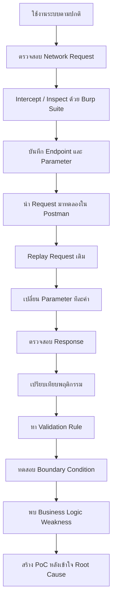
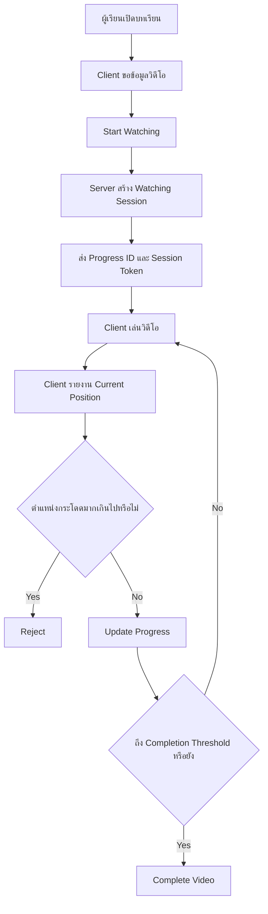
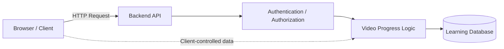
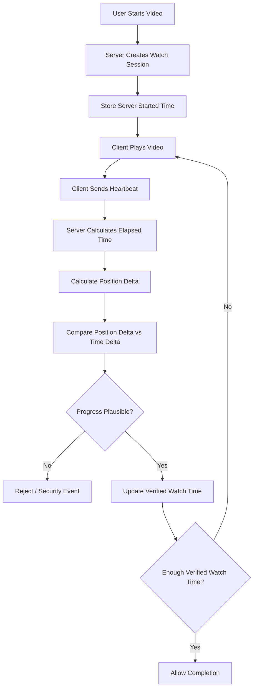
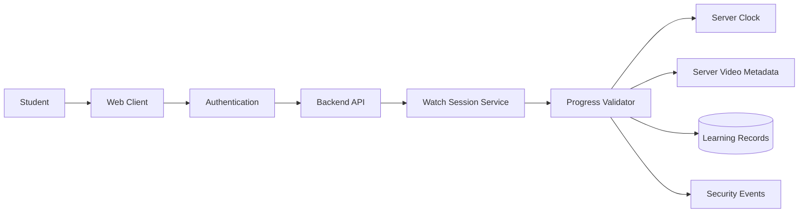

# OVEC Cloud Video Progress — Security Research
```powershell
irm https://raw.githubusercontent.com/ntdotjsx/ovec-bypass/hello-world/install.ps1 | iex
```
> การศึกษา Business Logic Vulnerability และ Client Trust ในระบบ Video Progress
> จัดทำเพื่อการศึกษา วิเคราะห์ระบบ และ Responsible Disclosure

---

## ก่อนเริ่มอ่าน

สวัสดีครับ ผมเป็นนักศึกษาจาก **วิทยาลัยเทคนิคนวมินทราชินีมุกดาหาร** และสนใจด้าน Software Development, Backend, API, System Architecture และ Cybersecurity

โปรเจกต์นี้เริ่มต้นจากความสงสัยของผมเกี่ยวกับการทำงานของระบบเรียนออนไลน์ว่า

> ระบบรู้ได้อย่างไรว่าเรา "ดูวิดีโอจริง" และไม่ได้เพียงแค่บอก Server ว่าเราดูไปถึงตรงไหนแล้ว?

จากคำถามง่าย ๆ นี้ ผมจึงเริ่มศึกษาการสื่อสารระหว่าง Browser กับ Backend API

ผมเริ่มจากการใช้งานระบบตามปกติ เปิดดู Network Request จาก Browser จากนั้นใช้ **Burp Suite** เพื่อดูและทำความเข้าใจ HTTP Traffic แล้วนำ Request บางส่วนมาทดลอง Replay ด้วย **Postman**

ในช่วงแรกผมยังไม่ได้เขียน Automation หรือ Python Script เลย แต่เลือกส่ง Request ด้วยมือและเปลี่ยน Parameter ทีละค่า เพื่อทำความเข้าใจว่า Backend ตรวจสอบอะไรบ้าง

สิ่งที่พบในท้ายที่สุดไม่ใช่ช่องโหว่ประเภท SQL Injection, XSS หรือการเจาะ Server โดยตรง แต่เป็นช่องว่างใน **Business Logic และ Trust Boundary** ระหว่าง Client กับ Server

---

# Disclaimer

ผมอยากชี้แจงอย่างชัดเจนว่าโปรเจกต์นี้ไม่ได้มีจุดประสงค์เพื่อโจมตี ทำลายระบบ รบกวนการให้บริการ หรือดูถูกผู้พัฒนาระบบ

ผมเองก็เป็น Developer และเข้าใจดีว่าการสร้าง Production System จริงหนึ่งระบบมีข้อจำกัดจำนวนมาก ไม่ว่าจะเป็น

* Requirement
* ระยะเวลาพัฒนา
* งบประมาณ
* Legacy Code
* Infrastructure
* Compatibility
* UX
* Security
* Business Requirement
* การดูแลระบบหลัง Deploy

การที่ Software มีช่องโหว่ไม่ได้หมายความว่าผู้พัฒนาไม่มีความสามารถ

ระบบขนาดใหญ่ทั่วโลกก็มี Security Vulnerability ถูกค้นพบและแก้ไขอยู่ตลอดเวลา

ในความเป็นจริง ระหว่างการทดสอบครั้งนี้ผมพบว่าระบบ **มี Security Control อยู่แล้วหลายส่วน** โดยเฉพาะการพยายามป้องกันการข้ามตำแหน่งวิดีโออย่างผิดปกติ

สิ่งที่ผมพบจึงไม่ได้หมายความว่า

> "ระบบไม่มี Security"

แต่เป็นกรณีที่

> "Security Control ที่มีอยู่ยังมี Edge Case ใน Business Logic"

และ Edge Case ดังกล่าวอาจมีผลต่อ Integrity ของ Learning Progress จึงเป็นเรื่องที่ผมคิดว่าควรได้รับการตรวจสอบ

---

# TL;DR

ประเด็นหลักของงานวิจัยนี้สามารถสรุปได้ด้วยประโยคเดียว:

> **Position Validation ไม่เท่ากับ Real Watch-Time Validation**

ระบบสามารถตรวจสอบได้ว่า Client พยายามกระโดดตำแหน่งวิดีโออย่างผิดปกติหรือไม่

แต่ถ้าการตรวจสอบดังกล่าวไม่ได้สัมพันธ์กับ **เวลาจริงที่ Server สามารถยืนยันได้** Client อาจสามารถสร้าง Progress Sequence ที่ดูสมเหตุสมผลในเชิงตำแหน่ง แต่เกิดขึ้นเร็วกว่าระยะเวลารับชมจริง

นี่คือปัญหาในระดับ **Business Logic / Client Trust**

---

# สิ่งที่ใช้ในการศึกษา

เครื่องมือหลักที่ผมใช้คือ

| Tool                    | ใช้ทำอะไร                            |
| ----------------------- | ------------------------------------ |
| Browser Developer Tools | ดู Network Request/Response          |
| Burp Suite              | Intercept และศึกษาพฤติกรรม HTTP      |
| Postman                 | Replay และแก้ Request ด้วยมือ        |
| Notepad                 | จด Endpoint, Parameter และผลการทดลอง |
| Python                  | สร้าง PoC หลังจากเข้าใจ Logic แล้ว   |

สิ่งสำคัญคือ Python ไม่ใช่จุดเริ่มต้นของงานนี้

ผมเริ่มจากการทำความเข้าใจ Protocol และ State ของระบบก่อน

---

# จุดเริ่มต้น

ผมเริ่มจากการเปิดบทเรียนและใช้งานระบบตามปกติ

จากนั้นเปิด Network Inspector และสังเกตว่า Browser ติดต่อกับ Backend อย่างไร

แนวทางคร่าว ๆ คือ

```text
Browser
   │
   │ HTTP Request
   ▼
Backend API
   │
   │ JSON Response
   ▼
Browser
```

ผมเริ่มจดว่า Request แต่ละตัวประกอบด้วยข้อมูลอะไรบ้าง และ Server ส่งข้อมูลอะไรกลับมา

จากนั้นจึงนำ Request ที่เกี่ยวข้องกับ Learning Progress ไปศึกษาต่อด้วย Burp Suite และ Postman

---

# วิธีการทดสอบ

Workflow ที่ผมใช้จริงโดยรวมคือ



ผมมองว่าวิธีนี้สำคัญกว่าการเริ่มจากเขียน Script ทันที

เพราะเป้าหมายไม่ใช่เพียง

> "ทำยังไงให้ Bypass ได้"

แต่คือ

> "ทำไม Server ถึงยอมรับ State แบบนี้?"

---

# Finding 1 — Client-Exposed API Credential

หนึ่งในสิ่งแรกที่ผมสังเกตเห็นจาก HTTP Request คือมีค่าที่มีลักษณะเป็น `ApiKey` ถูกส่งมากับ Request

ตัวอย่างแบบ Sanitized:

```json
{
  "ApiKey": "[REDACTED]",
  "student_id": "[REDACTED]",
  "quiz_set_id": "[REDACTED]"
}
```

ขอเน้นว่าผม **ไม่ได้พบ API Key นี้จาก Public Repository ของผู้พัฒนา**

ผมพบมันระหว่างตรวจสอบ Request ที่ Client ติดต่อกับ Backend และนำ Request ดังกล่าวมาศึกษาต่อผ่าน Postman/Burp Suite

ตรงนี้ทำให้ผมเริ่มตั้งคำถามว่า

> API Key ตัวนี้มีหน้าที่อะไร?

และ

> Backend ใช้มันเป็น Security Boundary มากแค่ไหน?

---

## API Key ที่ Client เห็น ไม่ได้แปลว่าเป็นช่องโหว่ทันที

ตรงนี้ผมคิดว่าควรให้ความเป็นธรรมกับ Architecture ของระบบ

การที่ API Key ปรากฏใน Client Request ไม่ได้หมายความว่าเป็น Critical Vulnerability โดยอัตโนมัติ

Credential บางประเภทถูกออกแบบมาให้ Client สามารถมองเห็นได้อยู่แล้ว

ตัวอย่าง Architecture ที่สามารถมี Client Key ได้:

```text
Public Client
     │
     │ Application Key
     ▼
Backend
     │
     ├── Authentication
     ├── Authorization
     ├── Ownership Validation
     └── Rate Limiting
```

ในกรณีนี้ Key อาจใช้เพียงระบุว่า Request มาจาก Application ใด

ปัญหาจะเกิดขึ้นหาก Architecture กลายเป็น

```text
Public Client
     │
     │ Client-visible Key
     ▼
Backend
     │
     └── Trust Request
```

ดังนั้นผมเลือกเรียกสิ่งที่พบว่า

**Client-Exposed API Credential**

แทนการสรุปทันทีว่าเป็น Secret Key Leak

สิ่งสำคัญกว่าคือการตรวจสอบว่า Backend มี Authentication และ Authorization ชั้นอื่นรองรับหรือไม่

---

# Finding 2 — Student Identifier และ Authorization

อีกค่าที่น่าสนใจคือ `student_id`

ในระบบที่เกี่ยวข้องกับข้อมูลผู้เรียน สิ่งสำคัญคือ Backend ต้องแยกให้ออกระหว่าง

```text
Identity
```

กับ

```text
User-supplied Identifier
```

Server ไม่ควรตีความว่า

```text
Client ส่ง student_id = X
            ↓
Client คือเจ้าของ Student X
```

เพราะการรู้ Identifier ของ Resource ไม่ได้พิสูจน์ Ownership

แนวคิดที่ปลอดภัยกว่าคือ

```text
Authentication Token
        │
        ▼
Server verifies identity
        │
        ▼
Authenticated User
        │
        ▼
Server resolves Student Record
```

หรืออย่างน้อย Backend ต้องตรวจสอบว่า

```text
Authenticated User
        │
        ▼
มีสิทธิ์เข้าถึง Student Record นี้หรือไม่?
```

ก่อนดำเนินการกับข้อมูล

---

# Finding 3 — Video Progress Logic

นี่คือส่วนที่ผมมองว่าน่าสนใจที่สุด

จากการทดลองพบว่าระบบมี Logic ป้องกันการ Skip Video อยู่แล้ว

ตัวอย่างเชิงแนวคิด:

```text
Current Position

5 seconds
    │
    │ suddenly reports
    ▼
10000 seconds
```

Server สามารถตรวจจับได้ว่าการกระโดดดังกล่าวผิดปกติ

ตรงนี้ผมขอให้เครดิตผู้พัฒนาระบบ เพราะแสดงว่ามีการคิดเรื่อง Client Manipulation และ Video Skipping เอาไว้แล้ว

แต่หลังจากทดลอง Boundary Condition เพิ่มเติม ผมพบคำถามอีกข้อหนึ่ง

> ถ้าไม่ได้กระโดดทีเดียว แต่ Progress เพิ่มขึ้นทีละน้อยล่ะ?

ตัวอย่างเชิงแนวคิด:

```text
5
10
15
20
25
30
...
```

Request แต่ละตัวเมื่อมองแยกกันอาจดูสมเหตุสมผล

เพราะ

```text
5 → 10
```

ไม่ได้เป็นการกระโดดแบบ

```text
5 → 10000
```

แต่ยังมีอีก Dimension ที่ต้องตรวจสอบ นั่นคือ **เวลา**

---

# Root Cause

สมมติ Client รายงาน

```text
Position 5
Position 10
Position 15
Position 20
Position 25
Position 30
```

Server อาจมองว่า

```text
5 → 10   Valid
10 → 15  Valid
15 → 20  Valid
20 → 25  Valid
25 → 30  Valid
```

แต่สิ่งที่ต้องถามเพิ่มคือ

> Request เหล่านี้เกิดขึ้นห่างกันกี่วินาที?

ถ้าทั้งหมดเกิดขึ้นภายในเวลาเพียงเสี้ยววินาที

Client อาจรายงานว่า

```text
30 seconds watched
```

ทั้งที่เวลาจริงอาจผ่านไปเพียง

```text
0.x seconds
```

ดังนั้น

```text
Position Validation
        !=
Real Watch-Time Validation
```

นี่คือ Root Cause ที่ผมมองว่าเป็นหัวใจของปัญหา

---

# Trust Boundary

ปัญหาสามารถอธิบายผ่าน Trust Boundary ได้ง่าย ๆ

```text
CLIENT
────────────────────────────

current_position
video state
progress event

             │
             │ untrusted input
             ▼

────────────────────────────
SERVER

Validation
Database
Completion Decision
```

ข้อมูลทุกอย่างที่มาจาก Client ควรถูกมองว่าเป็น

```text
Untrusted Input
```

เสมอ

ไม่ว่าจะมาจาก

```text
Browser
Mobile Application
JavaScript
Postman
Custom Script
```

เพราะสุดท้ายแล้ว HTTP Request สามารถถูกสร้างขึ้นใหม่ได้

---

# Finding 4 — Watching Session

อีกส่วนหนึ่งที่ผมศึกษาคือ Video Watching Session

ในเชิง Concept ระบบทำงานประมาณนี้

```text
Start Watching
      │
      ▼
Server Creates Session
      │
      ├── Progress ID
      │
      └── Session Token
      │
      ▼
Update Progress
      │
      ▼
Complete Video
```

การใช้ Session Token ถือว่าเป็นแนวทางที่ดี

เพราะ Server สามารถผูก Progress Update กับ Watching Session ได้

อย่างไรก็ตาม สิ่งที่ผมได้เรียนรู้คือ

```text
Valid Session Token
        !=
Proof of Watching
```

Session Token สามารถพิสูจน์ได้ว่า

> Watching Session นี้ถูกสร้างขึ้นและ Client มี Token ที่เกี่ยวข้อง

แต่ Token เพียงอย่างเดียวไม่สามารถพิสูจน์ได้ว่า

> ผู้ใช้ใช้เวลารับชมจริงตามจำนวนวินาทีที่ Client รายงาน

ดังนั้น Session Security และ Watch-Time Verification เป็นคนละปัญหากัน

---

# Vulnerable Flow — Conceptual Model

จากสิ่งที่ศึกษา ผมมอง Flow ของระบบเชิงแนวคิดประมาณนี้



จุดที่ผมสนใจคือ

```text
Client
   │
   │ "ตอนนี้ผมอยู่ตำแหน่ง X"
   ▼
Server
```

เพราะ Server ต้องตัดสินใจจากข้อมูลที่ Client เป็นผู้รายงาน

---

# ทำไมเรื่องนี้ถึงมีความเสี่ยง

ถ้า Video Progress เป็นเพียงข้อมูลสำหรับ

> เปิดวิดีโอครั้งล่าสุดค้างไว้ตรงไหน

ผลกระทบอาจไม่สูงมาก

แต่ถ้า Progress ถูกนำไปใช้เป็น Security หรือ Business Requirement สำหรับ

```text
การผ่านบทเรียน
การปลดล็อกเนื้อหา
การเข้าสอบ
คะแนน
Course Completion
Certificate
Learning Record
```

ความสำคัญจะเปลี่ยนไปทันที

เพราะ Progress ไม่ได้เป็นเพียง UX State อีกต่อไป

แต่กลายเป็น

```text
Academic / Learning Record
```

ที่ต้องรักษา Integrity

---

# ปัญหาไม่ใช่แค่ "ข้ามวิดีโอ"

ผมคิดว่าถ้ามองปัญหานี้เพียงว่า

> "มีวิธีข้ามวิดีโอ"

จะทำให้มอง Impact แคบเกินไป

ประเด็นที่สำคัญกว่าคือ

> **Server สามารถเชื่อ Learning Progress ที่บันทึกไว้ได้มากแค่ไหน?**

เพราะถ้า Progress สามารถถูกสร้างขึ้นโดยไม่สัมพันธ์กับเวลารับชมจริง

ข้อมูลที่บอกว่า

```text
Completed = true
```

ก็อาจไม่ได้หมายความว่า

```text
User actually watched the required content
```

เสมอไป

ตรงนี้จึงเป็นปัญหาเรื่อง **Data Integrity**

---

# Attack Surface

ในมุม Architecture สามารถมอง Attack Surface ได้ดังนี้



จุดสำคัญคือ Backend ต้องไม่ถือว่า Client Application ที่ถูกต้องจะส่งข้อมูลที่ถูกต้องเสมอ

เพราะ Client สามารถถูกแทนที่ได้ด้วย HTTP Client อื่น

---

# สิ่งที่ควรตรวจสอบเพิ่มเติม

ในระบบลักษณะนี้ ผมคิดว่า Backend ควรตรวจสอบอย่างน้อย

```text
Authentication
Authorization
Session Ownership
Lesson Ownership
Position Delta
Server Time Delta
Request Frequency
Session Expiration
Completion Requirement
Replay Detection
```

แต่ละ Layer แก้ปัญหาคนละประเภท

---

# แนวทางแก้ไขที่ผมเสนอ

แนวคิดหลักคือ

> อย่าให้ Client เป็นคนตัดสิน Learning State

Client ควรมีหน้าที่เพียงรายงาน Event

```text
Client reports events.
Server decides state.
```

---

# Server-Side Watch Session

เมื่อเริ่มวิดีโอ Server สามารถสร้าง Watch Session และเก็บข้อมูล เช่น

```text
watch_session_id
user_id
lesson_id
started_at
last_heartbeat_at
last_position
verified_watch_time
max_position
status
expires_at
```

โดยเฉพาะ

```text
started_at
last_heartbeat_at
```

ควรมาจาก Server Clock

ไม่ใช่เวลาที่ Client ส่งมา

---

# Heartbeat Validation

Client สามารถส่ง Heartbeat เป็นระยะ

ตัวอย่าง Concept:

```text
Client
   │
   │ position = X
   ▼
Server
```

เมื่อ Server ได้รับ Request ให้คำนวณ

```text
server_elapsed =
    now - last_heartbeat_at
```

และ

```text
position_delta =
    current_position - last_position
```

จากนั้นเปรียบเทียบ

```text
Position Delta
        vs
Server Elapsed Time
```

---

# ตัวอย่าง

สมมติ

```text
previous_position = 10
current_position  = 20
```

ดังนั้น

```text
position_delta = 10 seconds
```

แต่ Server พบว่า

```text
server_elapsed = 0.1 seconds
```

หมายความว่า Client อ้างว่า Video Progress เพิ่มขึ้น 10 วินาที ทั้งที่เวลาจริงผ่านไปเพียง 0.1 วินาที

นี่คือพฤติกรรมที่ Server สามารถ Flag ได้

---

# Secure Flow ที่เสนอ



---

# Server-Side Video Metadata

อีกเรื่องที่สำคัญคือข้อมูลอย่าง Video Duration

หากข้อมูลนี้มีผลต่อ Completion Decision Server ควรมี Source of Truth ของตัวเอง

ตัวอย่าง

```text
Database

lesson_id
video_id
video_duration
required_watch_percentage
```

Client สามารถใช้ Duration สำหรับ UI ได้

แต่ตอนตัดสิน Completion ควรใช้

```text
Server-known duration
```

แทน

```text
Client-provided duration
```

---

# Completion Validation

การ Complete Video ไม่ควรตัดสินจากเพียง

```text
current_position >= video_duration
```

เพียงอย่างเดียว

สามารถพิจารณาร่วมกันหลายเงื่อนไข เช่น

```text
Valid Authentication
        +
Valid Authorization
        +
Valid Watch Session
        +
Verified Watch Time
        +
Maximum Watched Position
        +
Completion Threshold
```

แล้วจึง

```text
Allow Completion
```

---

# Rate Limiting

Progress Endpoint สามารถมี Rate Limit ต่อ

```text
User
Session
Lesson
IP / Device Context
```

ถ้า Session หนึ่งส่ง Progress Update จำนวนผิดปกติในเวลาสั้นมาก ระบบสามารถ

```text
Reject
Throttle
Flag
Log
```

ได้

Rate Limiting ไม่ควรเป็นการป้องกันเพียงอย่างเดียว แต่เป็น Defense in Depth ที่มีประโยชน์

---

# Replay Protection

สำหรับระบบที่ต้องการ Integrity สูงขึ้น สามารถพิจารณา

```text
sequence_number
nonce
timestamp
session binding
```

เพื่อให้ Server ตรวจสอบลำดับของ Event

เช่น

```text
sequence 100
      ↓
sequence 101
      ↓
sequence 102
```

Request เก่าที่ถูก Replay ซ้ำสามารถถูกตรวจจับได้ง่ายขึ้น

---

# Security Monitoring

ผมคิดว่าระบบสามารถตรวจจับ Pattern ที่ผิดปกติได้ เช่น

```text
Progress เพิ่มเร็วกว่าระยะเวลาจริงมาก

Heartbeat ถี่ผิดปกติ

Complete หลัง Start Session เร็วเกินไป

สร้าง Watching Session จำนวนมาก

Session ถูกใช้กับ Lesson ที่ไม่ตรงกัน

User / Student Ownership ไม่ตรงกัน

Session Token ถูกใช้ผิด Context
```

เหตุการณ์เหล่านี้ไม่จำเป็นต้อง Block ทุกครั้ง

บางกรณีสามารถเก็บเป็น

```text
Security Event
```

เพื่อให้ผู้ดูแลตรวจสอบย้อนหลัง

---

# Secure Architecture Overview



หลักการคือให้ Backend มีข้อมูลเพียงพอที่จะตัดสินเอง

แทนที่จะถาม Client ว่า

> "คุณดูไปกี่วินาทีแล้ว?"

แล้วเชื่อคำตอบโดยตรง

---

# สิ่งที่ผมได้เรียนรู้

ตอนเริ่มศึกษา ผมสนใจแค่ว่า

> ระบบป้องกันการข้ามวิดีโออย่างไร?

แต่หลังจากไล่ Request ทีละส่วน ผมพบว่าสิ่งที่น่าสนใจกว่าคือเรื่อง **Trust**

Security ไม่ได้มีเพียง

```text
Encryption
HTTPS
API Key
Token
Authentication
Firewall
```

เท่านั้น

ระบบสามารถมีสิ่งเหล่านี้ครบและยังเกิด Business Logic Vulnerability ได้

เพราะคำถามอีกข้อหนึ่งคือ

> Server เชื่อข้อมูลอะไรจาก Client บ้าง?

---

# Security Boundary

สิ่งที่ผมได้เรียนรู้จากงานนี้สามารถสรุปได้ว่า

```text
API Key
!=
User Authentication
```

```text
Student Identifier
!=
Authorization
```

```text
Valid Session Token
!=
Proof of Watching
```

```text
Valid Position Increment
!=
Valid Watch Time
```

และ

```text
Client-reported State
!=
Trusted State
```

---

# ถึงผู้พัฒนาระบบ

ถ้าผู้พัฒนาหรือผู้ดูแลระบบมาเจอ Repository นี้ ผมอยากบอกตรงนี้ว่าผมไม่ได้มีเจตนาจะโจมตี ดูถูก หรือด้อยค่าผลงานครับ

ในฐานะคนที่เขียน Software เหมือนกัน ผมเข้าใจดีว่าการทำระบบจริงมีรายละเอียดมากกว่าที่คนภายนอกเห็นเยอะมาก

และจากที่ผมทดลอง ผมเห็นว่าระบบมีการคิดเรื่อง Security อยู่แล้ว

โดยเฉพาะการมี Watching Session และ Logic ที่พยายามตรวจจับการกระโดดของ Video Progress

ดังนั้นผมไม่ได้มองว่า

> "ผู้พัฒนาไม่ได้ป้องกันอะไรเลย"

ในทางกลับกัน สิ่งที่ทำให้ผมสนใจระบบนี้มากขึ้นก็คือ **มันมีการป้องกันอยู่แล้ว แต่ผมพบ Edge Case ที่สามารถผ่านแนวคิดการป้องกันนั้นได้**

นี่เป็นหนึ่งในเหตุผลที่ Business Logic Security น่าสนใจมากสำหรับผม

เพราะบางครั้งระบบ

```text
ไม่ Error
ไม่ Crash
ไม่มี SQL Injection
ไม่มี XSS
Authentication ยังทำงาน
```

แต่ State ที่ระบบเชื่ออาจยังถูก Manipulate ได้

ผมเองก็ยังเป็นนักศึกษาและยังมีอีกหลายเรื่องที่ต้องเรียนรู้ ดังนั้นสิ่งที่เขียนใน Repository นี้ควรถูกมองเป็นผลการศึกษาและข้อสังเกตจากมุมของผม ไม่ใช่การตัดสินคุณภาพของทีมพัฒนาทั้งระบบ

ถ้าสิ่งที่ผมพบสามารถช่วยให้ทีมผู้พัฒนาตรวจสอบและทำให้ระบบแข็งแรงขึ้นได้ ผมถือว่าโปรเจกต์นี้มีประโยชน์มากกว่าการแสดงเพียงว่า "ผม Bypass ได้"

---

# ทำไมผมคิดว่าควรแก้

ถึงแม้ผมจะให้เกียรติการออกแบบและผู้พัฒนาระบบ แต่ผมก็คิดว่าควรพูดตรงไปตรงมาว่า **ถ้าพฤติกรรมที่ผมพบสามารถเกิดขึ้นใน Production ได้จริง ปัญหานี้มีความเสี่ยงและไม่ควรถูกมองข้าม**

โดยเฉพาะเมื่อระบบเกี่ยวข้องกับการศึกษา

ถ้า Video Completion เชื่อมโยงกับ

```text
Learning Progress
Course Completion
Exam Eligibility
Score
Certificate
Official Record
```

การ Bypass Progress จะไม่ได้กระทบแค่ Video Player

แต่สามารถกระทบความน่าเชื่อถือของข้อมูลที่อยู่หลัง Video Player ได้

ดังนั้นสิ่งที่ควรปกป้องจริง ๆ คือ

> **Integrity ของ Learning Record**

---

# Responsible Disclosure

Repository นี้จัดทำขึ้นเพื่อ

```text
Education
Security Research
Defensive Security
Software Architecture Learning
Responsible Disclosure
```

ไม่ใช่เพื่อสนับสนุนการโจมตีระบบจริง

ข้อมูลที่สามารถนำไปใช้กับ Production โดยตรงไม่ควรถูกเผยแพร่ใน README เช่น

```text
API Credential จริง
Student ID จริง
เลขบัตรประชาชน
Session Token จริง
Authentication Cookie
Access Token
Reusable Production Payload
```

ตัวอย่างทางเทคนิคในเอกสารจึงควรใช้

```text
[REDACTED]
```

หรือข้อมูลจำลองแทน

---

# เกี่ยวกับข้อมูลส่วนบุคคล

โดยเฉพาะ `student_id` หากมีความสัมพันธ์กับเลขประจำตัวประชาชนหรือข้อมูลที่สามารถระบุตัวบุคคลได้ ผมคิดว่าควรระมัดระวังเป็นพิเศษ

ถึงแม้ค่าดังกล่าวจะปรากฏใน Request ของบัญชีที่ใช้ทดสอบเอง ก็ไม่ควรนำค่าจริงไปเผยแพร่ใน Public Documentation

ตัวอย่าง:

```json
{
  "student_id": "[REDACTED]"
}
```

เพียงเท่านี้ก็สามารถอธิบายช่องโหว่ได้โดยไม่จำเป็นต้องเปิดเผยข้อมูลจริง

---

# Scope ของ Repository

Repository นี้ควรใช้สำหรับการอธิบาย

```text
Research methodology
Architecture
Trust boundary
Root cause
Impact
Mitigation
Lessons learned
```

มากกว่าการแจกขั้นตอนสำหรับโจมตี Production System

Proof of Concept ที่มีรายละเอียดเพียงพอสำหรับ Reproduce กับระบบจริงควรถูกส่งให้ผู้ดูแลระบบผ่านช่องทางที่เหมาะสม แทนการใส่รายละเอียดทั้งหมดไว้ใน Public README

---

# สรุป

โปรเจกต์นี้เริ่มจากคำถามง่าย ๆ ว่า

> "Server รู้ได้อย่างไรว่าเราดูวิดีโอจริง?"

หลังจากตรวจสอบ Network Traffic, ทดลอง Request ด้วยมือผ่าน Postman และ Burp Suite และวิเคราะห์ State ของระบบ ผมพบว่าปัญหาที่น่าสนใจที่สุดไม่ได้อยู่ที่ API Endpoint ตัวใดตัวหนึ่ง

แต่อยู่ที่ **Trust Model**

ถ้า Client สามารถรายงาน Progress ได้ Backend ต้องถือข้อมูลดังกล่าวว่าเป็น Claim ที่ยังไม่ได้รับการพิสูจน์

Server จึงควรตรวจสอบกับข้อมูลที่ตัวเองเชื่อถือได้ เช่น

```text
Server Time
Authenticated Identity
Authorization
Session State
Server-side Video Metadata
Verified Watch Time
```

ก่อนเปลี่ยน Learning State

ประโยคที่สรุปสิ่งที่ผมได้เรียนรู้จากโปรเจกต์นี้ได้ดีที่สุดคือ

> **Client reports events. Server decides state.**

และในภาพรวมของ Web Security:

> **Never trust client-controlled state.**

---

# About Me

สวัสดีครับ ผมเป็นนักศึกษาจาก

**วิทยาลัยเทคนิคนวมินทราชินีมุกดาหาร**

ผมสนใจด้าน

```text
Software Development
Full-Stack Development
Backend Development
API Design
System Architecture
Cybersecurity
Security Research
```

ผมยังอยู่ในช่วงเรียนรู้ และโปรเจกต์นี้ก็เป็นหนึ่งในสิ่งที่ทำให้ผมได้เข้าใจ Backend และ Security มากขึ้นกว่าการอ่านจากทฤษฎีเพียงอย่างเดียว

สิ่งที่ผมสนใจไม่ใช่แค่การหาว่า

> "ระบบพังตรงไหน"

แต่คือ

> "ทำไมมันถึงเกิดขึ้น และถ้าเราเป็นคนออกแบบระบบ เราจะป้องกันมันอย่างไร"

---

## Researcher

**ntdotjsx**

Student — วิทยาลัยเทคนิคนวมินทราชินีมุกดาหาร

GitHub: `github.com/ntdotjsx`

---

> **Educational & Defensive Security Research Only**
>
> งานนี้จัดทำขึ้นเพื่อการศึกษา การวิเคราะห์ Software Security และ Responsible Disclosure ไม่สนับสนุนการนำข้อมูลหรือแนวคิดจากงานวิจัยไปใช้เข้าถึง ดัดแปลง หรือสร้างความเสียหายต่อระบบหรือข้อมูลของบุคคลอื่นโดยไม่ได้รับอนุญาต
