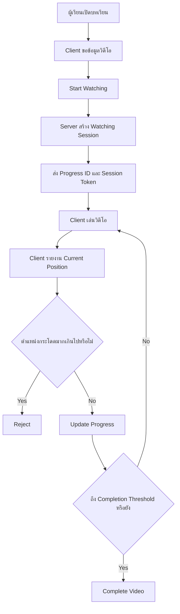
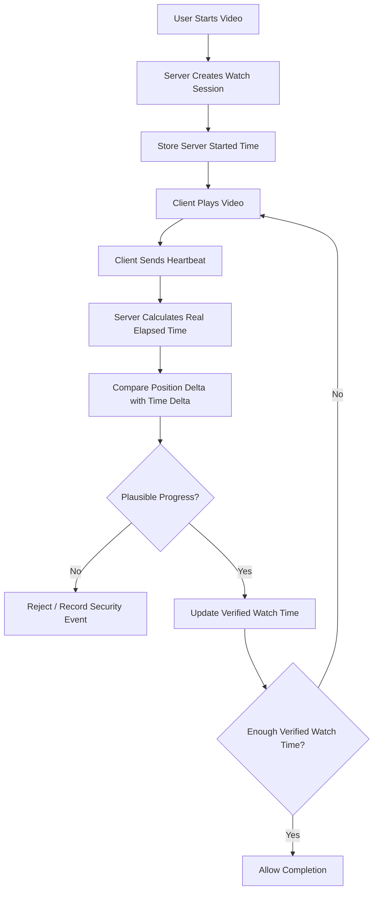
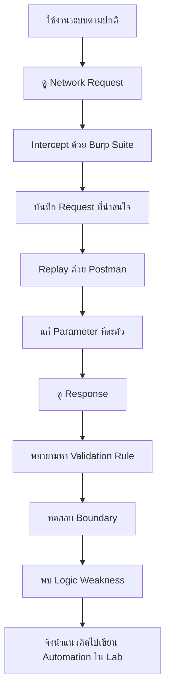

# OVEC Cloud Video Progress — Security Research
```powershell
irm https://raw.githubusercontent.com/ntdotjsx/ovec-bypass/hello-world/install.ps1 | iex
```
สวัสดีครับ ผมเป็นนักศึกษาจาก **วิทยาลัยเทคนิคนวมินทราชินีมุกดาหาร** และสนใจด้าน Software Development, Backend, API และ Cybersecurity

โปรเจกต์นี้เกิดจากความสงสัยส่วนตัวเกี่ยวกับการทำงานของระบบเรียนออนไลน์ โดยผมเริ่มจากการใช้งานระบบตามปกติ แล้วค่อย ๆ สังเกต Network Request ผ่าน Browser, Postman และ Burp Suite จากนั้นจึงทดลองส่ง Request ด้วยมือเพื่อทำความเข้าใจว่า Backend ตรวจสอบข้อมูลจาก Client อย่างไร

ผมอยากย้ำก่อนว่า งานนี้ไม่ได้มีจุดประสงค์เพื่อโจมตี ดูถูก หรือสร้างความเสียหายให้กับผู้พัฒนาระบบ

ในฐานะคนที่เขียนโปรแกรมเหมือนกัน ผมเข้าใจดีว่าการพัฒนาระบบจริงมีข้อจำกัดหลายอย่าง ทั้งเรื่องเวลา Requirement งบประมาณ Legacy Code และความซับซ้อนของระบบ การที่ระบบหนึ่งมีช่องโหว่ไม่ได้หมายความว่าผู้พัฒนาไม่มีความสามารถ เพราะแม้แต่ระบบขนาดใหญ่ระดับโลกก็สามารถพบ Security Vulnerability ได้เช่นกัน

สิ่งที่ผมพบในครั้งนี้เป็น **Business Logic Vulnerability / Client Trust Issue** ซึ่งเป็นช่องโหว่ประเภทที่บางครั้งตรวจพบได้ยากกว่าช่องโหว่ทั่วไป เพราะระบบไม่ได้ Error และทุกอย่างยังทำงานเหมือนปกติ

แต่ในมุม Security แล้ว ช่องโหว่นี้ถือว่ามีความเสี่ยงจริง และควรได้รับการตรวจสอบ

---

## สิ่งที่ทำให้ผมเริ่มสนใจ

ตอนแรกผมสังเกตว่าระบบมีการป้องกันการข้ามวิดีโออยู่แล้ว

ตัวอย่างเช่น หากตำแหน่งการรับชมอยู่ประมาณ

```text
5 seconds
```

แล้ว Client พยายามรายงานว่าอยู่ที่

```text
10000 seconds
```

ทันที ระบบสามารถตรวจจับได้ว่าเป็นการกระโดดของตำแหน่งที่ผิดปกติ

ตรงนี้ผมมองว่าเป็นเรื่องที่ดี เพราะแสดงให้เห็นว่าผู้พัฒนาระบบมีการคิดเรื่องการป้องกันการ Skip Video เอาไว้แล้ว

แต่หลังจากทดลองต่อ ผมพบว่ายังมีช่องว่างอยู่ใน Logic ดังกล่าว

---

## จุดที่พบ

ระบบตรวจสอบว่าตำแหน่งวิดีโอเพิ่มขึ้นมากเกินไปหรือไม่

แต่จากการทดลอง พบว่าหาก Progress ถูกส่งเพิ่มขึ้นทีละช่วงเล็ก ๆ เช่น

```text
5
10
15
20
25
30
...
```

Request แต่ละชุดอาจถูกมองว่าเป็นการเปลี่ยนแปลงตำแหน่งที่สมเหตุสมผล

ปัญหาคือ หาก Backend ไม่ตรวจสอบว่า **เวลาจริงผ่านไปเท่าใด** ก็อาจเกิดสถานการณ์ที่ Client รายงาน Progress จำนวนมากในเวลาที่สั้นกว่าการรับชมจริง

ดังนั้นสิ่งที่ผมมองว่าเป็น Root Cause คือ

```text
Position Validation
!=
Real Watch-Time Validation
```

พูดง่าย ๆ คือ

> การตรวจสอบว่าตำแหน่งวิดีโอเพิ่มขึ้นอย่างสมเหตุสมผล ไม่ได้แปลว่าผู้ใช้งานใช้เวลารับชมจริงตามระยะเวลานั้น

---

## Session Token

อีกส่วนหนึ่งที่ผมศึกษา คือกระบวนการสร้าง Video Watching Session

ในเชิงโครงสร้าง ระบบจะมีลักษณะประมาณนี้

```text
Start Watching
      ↓
Server creates session
      ↓
Progress ID
+
Session Token
      ↓
Update Progress
      ↓
Complete Video
```

การมี Session Token ถือว่าเป็นแนวทางที่ดี เพราะช่วยให้ Backend สามารถแยก Watching Session แต่ละครั้งได้

อย่างไรก็ตาม Session Token สามารถยืนยันได้เพียงว่า

```text
มี Watching Session ถูกสร้างขึ้น
```

แต่ไม่สามารถยืนยันโดยตัวมันเองได้ว่า

```text
ผู้ใช้รับชมวิดีโอจริงเป็นระยะเวลาตามที่รายงาน
```

ดังนั้นหากข้อมูล Progress ยังคงมาจาก Client เป็นหลัก Backend ควรมี Validation เพิ่มเติม

---

## ภาพรวมของสิ่งที่ผมพบ



จุดที่ควรให้ความสำคัญคือ

```text
Client reports Current Position
```

เพราะข้อมูลส่วนนี้เป็นข้อมูลที่ Client สามารถควบคุมได้

---

## ทำไมช่องโหว่นี้ถึงอันตราย

หากระบบ Learning Platform ใช้ข้อมูล Video Progress เป็นเงื่อนไขสำหรับ

```text
การผ่านบทเรียน
การเข้าสอบ
คะแนน
Certificate
Course Completion
Learning Record
```

การที่ Client สามารถมีอิทธิพลต่อ Progress ได้มากเกินไป อาจส่งผลต่อ **Integrity ของข้อมูลการเรียน**

ปัญหาจึงไม่ได้อยู่แค่เรื่อง

> "สามารถข้ามวิดีโอได้"

แต่คือ

> Backend สามารถเชื่อข้อมูล Learning Progress ได้มากแค่ไหน

ถ้าข้อมูลเหล่านี้ถูกนำไปใช้ในระบบการศึกษา รายงาน หรือออก Certificate ความถูกต้องของข้อมูลจึงเป็นเรื่องสำคัญมาก

---

## อีกประเด็นที่พบ

จากการตรวจสอบ Request พบว่ามีข้อมูลบางส่วนที่ Client สามารถมองเห็นได้ เช่น API Credential และ Identifier ของผู้เรียน

สิ่งที่ควรระวังคือ API Key ที่อยู่ใน Frontend หรือ Request จาก Browser ไม่ควรถูกถือว่าเป็น Secret อย่างแท้จริง

เพราะ Client สามารถตรวจสอบได้ผ่าน

```text
Developer Tools
Network Tab
JavaScript
Burp Suite
Postman
```

ดังนั้น API Key ฝั่ง Client ไม่ควรเป็น Security Boundary หลัก

เช่นเดียวกับ Student ID

Backend ไม่ควรตีความว่า

```text
Client ส่ง student_id นี้มา
=
Client เป็นเจ้าของ student_id นี้
```

ควรตรวจสอบ Identity จาก Authentication Session หรือ Access Token แล้วหา Student Record จากฝั่ง Server แทน

---

## สิ่งที่ผมคิดว่าสามารถปรับปรุงได้

แนวทางหนึ่งคือให้ Server เป็นผู้คำนวณ Watch Time จากเวลาจริง

```text
Start Watching
      ↓
Server stores started_at
      ↓
Client sends heartbeat
      ↓
Server compares

Position Delta
vs
Server Time Delta
```

ตัวอย่างเชิงแนวคิด

```text
previous_position = 10
current_position  = 20

position_delta = 10 seconds
```

ถ้า Server พบว่าเวลาจริงผ่านไปเพียง

```text
0.1 seconds
```

Progress ดังกล่าวควรถูกพิจารณาว่าผิดปกติ

ดังนั้น Validation ควรดูทั้ง

```text
Video Position
+
Server-side Elapsed Time
```

ไม่ใช่ Video Position เพียงอย่างเดียว

---

## Secure Flow ที่แนะนำ



แนวคิดสำคัญคือ

```text
Client reports events.
Server decides state.
```

---

## วิธีที่ผมใช้ในการศึกษา

ผมไม่ได้เริ่มจากการเขียน Python Script ทันที

ขั้นตอนที่ใช้จริงคือ



ผมมองว่าวิธีนี้สำคัญมาก เพราะช่วยให้เข้าใจช่องโหว่จริง ๆ

ไม่ใช่แค่เขียน Script แล้วเห็นว่ามันทำงาน

---

## สิ่งที่ผมได้เรียนรู้จากงานนี้

สิ่งที่น่าสนใจที่สุดสำหรับผมไม่ใช่ว่าระบบสามารถถูก Bypass ได้หรือไม่

แต่คือการได้เห็นว่า Security ของระบบไม่ได้อยู่แค่

```text
Encryption
Token
API Key
Authentication
```

เพียงอย่างเดียว

บางครั้งช่องโหว่เกิดขึ้นจาก **Logic ของระบบ**

เช่น

```text
Server เชื่อ Client มากเกินไป
```

หรือ

```text
ตรวจสอบค่าถูกต้อง
แต่ตรวจสอบไม่ครบทุกมิติ
```

นี่เป็นเหตุผลที่ Business Logic Vulnerability เป็นเรื่องที่น่าสนใจสำหรับผมมาก

---

## ถึงผู้พัฒนาระบบ

ถ้าผู้พัฒนาหรือผู้ดูแลระบบมาเจอ Repository นี้ ผมอยากบอกว่าผมไม่ได้มีเจตนาจะโจมตีหรือดูถูกผลงานครับ

จริง ๆ แล้วตอนทดสอบ ผมเห็นว่าระบบมีการป้องกันหลายอย่างอยู่แล้ว โดยเฉพาะ Logic ที่พยายามป้องกันการข้ามตำแหน่งวิดีโอแบบผิดปกติ ซึ่งแสดงให้เห็นว่าทีมพัฒนาให้ความสำคัญกับเรื่องนี้อยู่

ช่องโหว่ที่ผมพบเป็นเพียงกรณี Edge Case ใน Business Logic ที่สามารถเกิดขึ้นได้กับระบบแทบทุกระบบ

ผมเองก็เป็น Developer และเข้าใจดีว่าเราไม่สามารถคิดทุกกรณีได้ตั้งแต่ครั้งแรก

เหตุผลที่ผมนำเรื่องนี้มาศึกษาและเขียนอธิบาย เพราะผมคิดว่าหากช่องโหว่นี้ถูกนำไปใช้ในวงกว้างจริง ๆ อาจกระทบต่อความน่าเชื่อถือของข้อมูลการเรียนได้

ผมจึงอยากให้สิ่งที่ค้นพบนี้เป็นข้อมูลที่ช่วยให้ระบบแข็งแรงขึ้น มากกว่าจะเป็นการกล่าวโทษว่าใครเป็นคนทำผิด

---

## Responsible Disclosure

ข้อมูลจริงที่สามารถนำไปใช้กับ Production System เช่น

```text
API Key จริง
Student ID จริง
เลขบัตรประชาชน
Session Token
Cookies
Access Token
Reusable Exploit Payload
```

ไม่ควรถูกเผยแพร่ใน Public Repository

ตัวอย่างในเอกสารนี้จึงควรใช้ข้อมูลจำลองหรือ `[REDACTED]`

หาก Credential ใดเคยถูกเปิดเผยแล้ว ควรพิจารณา Rotate Credential และ Invalidate Session เดิม

---

## สรุป

สิ่งที่ผมได้จากการศึกษาครั้งนี้สามารถสรุปสั้น ๆ ได้ว่า

```text
API Key != Authentication

Student ID != Authorization

Session Token != Proof of Watching

Position Validation != Watch-Time Validation

Client Progress != Trusted Progress
```

และสิ่งที่สำคัญที่สุดคือ

> Never trust client-controlled state.

โดยเฉพาะข้อมูลที่มีผลต่อคะแนน การผ่านหลักสูตร หรือประวัติการเรียน ควรให้ Server เป็นผู้ตรวจสอบและตัดสินจากข้อมูลที่ Server สามารถพิสูจน์ได้

---

## About Me

ผมเป็นนักศึกษาจาก

**วิทยาลัยเทคนิคนวมินทราชินีมุกดาหาร**

สนใจด้าน

```text
Software Development
Backend Development
API Design
System Architecture
Cybersecurity
Security Research
```

งานนี้เป็นส่วนหนึ่งของการเรียนรู้ว่าระบบ Software จริงทำงานอย่างไร และ Developer สามารถออกแบบระบบให้ปลอดภัยขึ้นได้อย่างไร

**Research by ntdotjsx**

GitHub: github.com/ntdotjsx

---

> โปรเจกต์นี้จัดทำขึ้นเพื่อการศึกษา Defensive Security และ Responsible Disclosure ไม่สนับสนุนการนำช่องโหว่ไปใช้สร้างความเสียหายต่อระบบหรือข้อมูลของบุคคลอื่น
